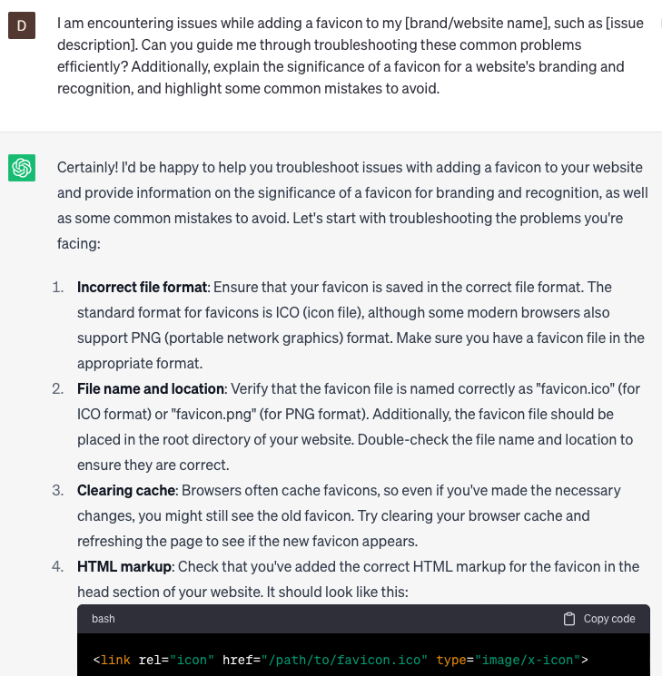

# Add favicon to website

### FILL-IN-THE-BLANK **PROMPTS:**

```jsx
What are the current advancements in favicon design, and how can I craft a **[distinctive/visually captivating]** favicon that effectively embodies the essence of my **[brand /website name]**?
```

```jsx
I am encountering issues while adding a favicon to my **[brand/website name]**, such as **[issue description]**. Can you guide me through troubleshooting these common problems efficiently? Additionally, explain the significance of a favicon for a website's branding and recognition, and highlight some common mistakes to avoid.
```

```jsx
Help me optimize my website's favicon for [**SEO/performance/accessibility]**, and suggest the best practices for **[using/choosing/uploading]** favicons that comply with web standards and guidelines.
```

### QUESTIONS-BASED P**ROMPTS:**

1. "Why is a favicon important for a website's branding and recognition?"
2. "What are the recommended dimensions for a favicon?"
3. "How can I create a favicon from an existing logo or image?"
4. "What is the process of adding a favicon to a website's HTML code?"
5. "Are there any specific file formats that should be used for a favicon?"
6. "What steps should I follow to ensure cross-browser compatibility for the favicon?"
7. "Can you suggest any online tools or resources for generating favicons?"
8. "How can I test and verify that the favicon is correctly implemented on my website?"
9. "Are there any best practices for optimizing the file size and loading speed of a favicon?"
10. "

### EXAMPLES:

