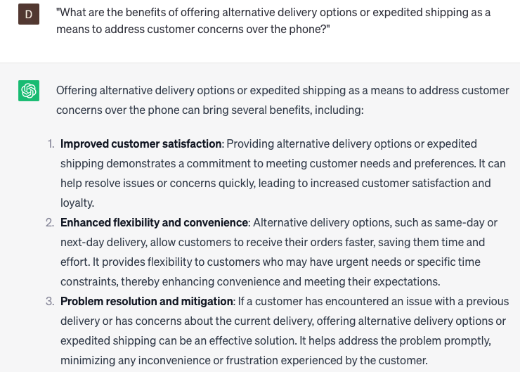

# Addressing shipping and delivery issues over the phone

### FILL-IN-THE-BLANK **PROMPTS:**

```jsx
I'm currently facing challenges in **[resolving/handling] [shipping/delivery]** issues **[over the phone/with customers]**. Could you provide me with some **[strategies/tips]** to effectively **[communicate/manage customer expectations]** during these conversations?
```

```jsx
I lack experience in handling **[shipping/delivery]** issues over the phone. Could you please offer **[examples/scripts]** illustrating **[what to say/how to respond]** when customers **[complain/report problems]** related to their **[orders/shipments]**?
```

```jsx
I have some **[concerns / curiosity]** regarding **[mitigating / evading] [difficulties / challenges]** in **[phone-based / customer-related] [shipping / delivery]** encounters. Could you propose **[proactive / preventive]** strategies we could **[adopt / convey]** to **[enhance / elevate]** our customers' **[shipping / delivery]** satisfaction?
```

### QUESTIONS-BASED P**ROMPTS:**

1. "How can addressing shipping and delivery issues over the phone ensure timely and satisfactory resolutions for customers?"
2. "What key information and documentation should be gathered during phone conversations to address shipping and delivery issues effectively?"
3. "How can active listening and empathy be incorporated into phone interactions to understand the customer's frustration and provide reassurance?"
4. "What strategies can be employed to track and trace shipments during phone conversations to provide accurate and up-to-date information to customers?"
5. "How can clear and concise communication be maintained when explaining shipping and delivery processes, policies, and potential solutions over the phone?"
6. "What role does collaboration with logistics partners and carriers play in resolving shipping and delivery issues over the phone?"
7. "What are the benefits of offering alternative delivery options or expedited shipping as a means to address customer concerns over the phone?"
8. "How can customer service representatives proactively follow up with customers after resolving shipping and delivery issues to ensure satisfaction?"
9. "What techniques can be used to document and analyze common shipping and delivery issues to identify patterns and improve processes?"
10. "In what ways can ongoing training and knowledge sharing empower customer service representatives to effectively address shipping and delivery issues over the phone?"

### EXAMPLES:

