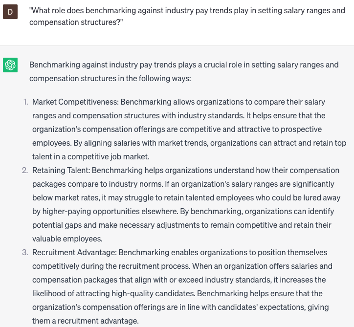

# Analyzing market pay trends

### FILL-IN-THE-BLANK **PROMPTS:**

```jsx
What are the prevailing salary trends in the job market for individuals holding the position of **[job title]** with **[number]** years of experience and proficiency in **[specific skill]**, specifically in **[location]** where the cost of living index is **[index number]**, and possessing **[specific certification]** certification?
```

```jsx
What has been the historical evolution of the average salary in the **[industry]** sector within **[country]** over the past **[number]** years, considering the influence of **[specific factor], [specific factor],** and **[specific factor]**, and what is the anticipated salary growth expected for the upcoming **[number]** years?
```

```jsx
What is the customary compensation package offered for **[job level]** roles within **[company size]** organizations located in **[city/region]**, encompassing benefits such as **[specific benefit]**, **[specific benefit]**, incentives such as **[specific incentive]**, and **[specific incentive]**? How does this package compare to the industry's average compensation?
```

### QUESTIONS-BASED P**ROMPTS:**

1. "How can analyzing market pay trends help organizations ensure competitive compensation packages that attract and retain top talent?"
2. "What role does benchmarking against industry pay trends play in setting salary ranges and compensation structures?"
3. "Why is it important to regularly monitor and analyze market pay trends to stay informed about changes in the labor market?"
4. "How can analyzing market pay trends help organizations address pay equity and ensure fair and transparent compensation practices?"
5. "What strategies can be employed to effectively gather and analyze market pay data from reliable sources?"
6. "In what ways can analyzing market pay trends assist organizations in making informed decisions regarding salary adjustments and incentive programs?"
7. "What considerations should be taken into account when comparing market pay trends across different geographical regions or industries?"
8. "How can organizations leverage market pay trend analysis to align compensation strategies with business goals and talent acquisition strategies?"
9. "What are the potential risks and challenges associated with relying solely on market pay trends in determining employee compensation?"
10. "How can organizations use market pay trend analysis to proactively address retention challenges and ensure competitive total rewards packages?"

### EXAMPLES:

