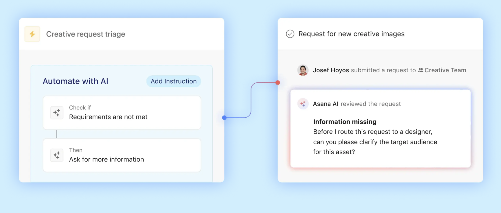
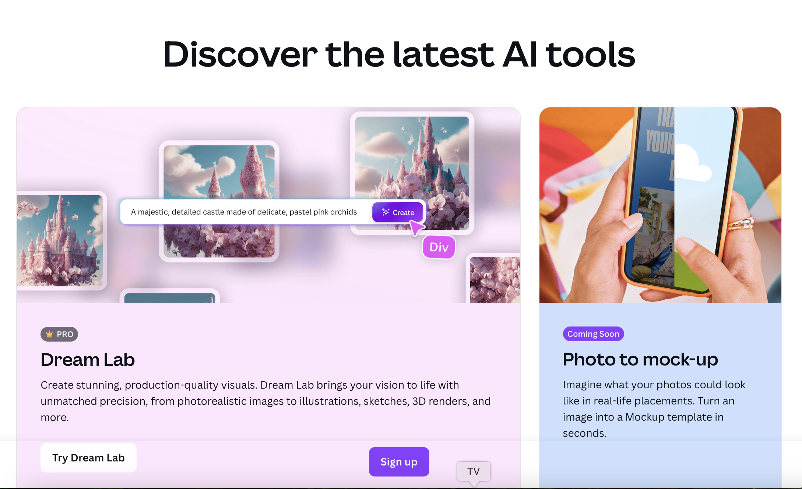

# BONUS: Perfect AI Partner

If you’re a **Content Marketing Manager**, you know how overwhelming it can be to stay on top of everything—content briefs, deadlines, task assignments. 

[**Asana AI**](https://asana.com/product/ai) makes it easier to stay organized by automating task assignments and keeping track of progress across your team. 

You can also use [**Notion AI**](https://www.notion.com/help/guides/category/ai) to quickly generate content ideas, structure them into a solid plan, and stay on top of your content calendar.

As a **Content Creator**, your time is valuable, and you don’t want to waste it figuring out how to make everything look professional. 

[**Runway AI**](https://runwayml.com) is your go-to tool for creating videos quickly—whether it’s for TikTok, Instagram, or YouTube. 

Then, [**Canva Magic Studio**](https://www.canva.com/magic/) steps in for designing stunning visuals.

If you’re working in **SEO Content**, you’ve probably spent hours optimizing content for search engines. 

With [**Surfer SEO**](https://surferseo.com), you can simplify the process by getting content suggestions and SEO guidelines tailored to your target keywords. 

For **Social Media Managers**, creating eye-catching ads and content can take a lot of time.

[**AdCreative.ai**](https://www.adcreative.ai) is a great tool for generating high-performing ad visuals and copy in minutes, tailored for platforms like Facebook and Instagram. 

Once you’ve got your ads, use [**InVideo AI**](https://invideo.io) to turn blog posts or long-form content into engaging videos for social media.

