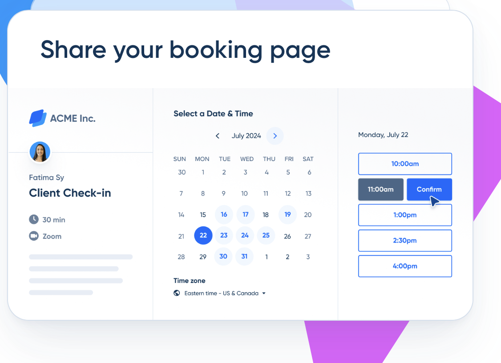

# BONUS: Perfect AI Partner

If you're a **Virtual Assistant**, tools like **Zapier** and **Calendly** can help you automate tasks and keep clients organized. 

[**Zapier**](https://zapier.com) is great for automating repetitive tasks by connecting apps—like automatically adding new email contacts to a CRM or scheduling social media posts. 

[**Calendly**](https://calendly.com) simplifies scheduling by allowing clients to book appointments directly in your calendar, saving you time on back-and-forth emails. 

