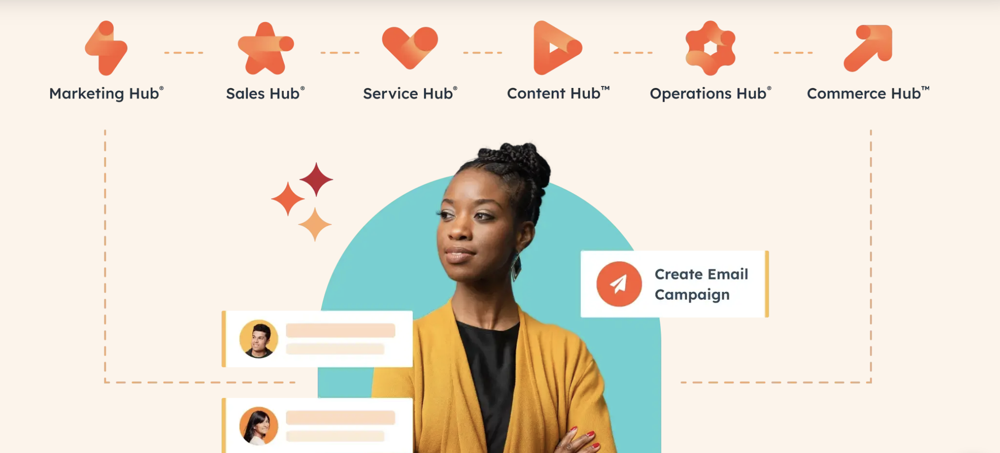
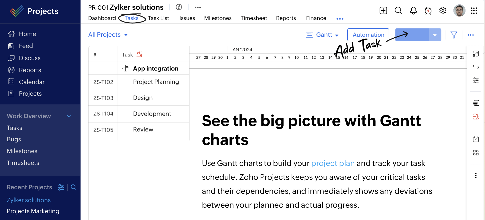
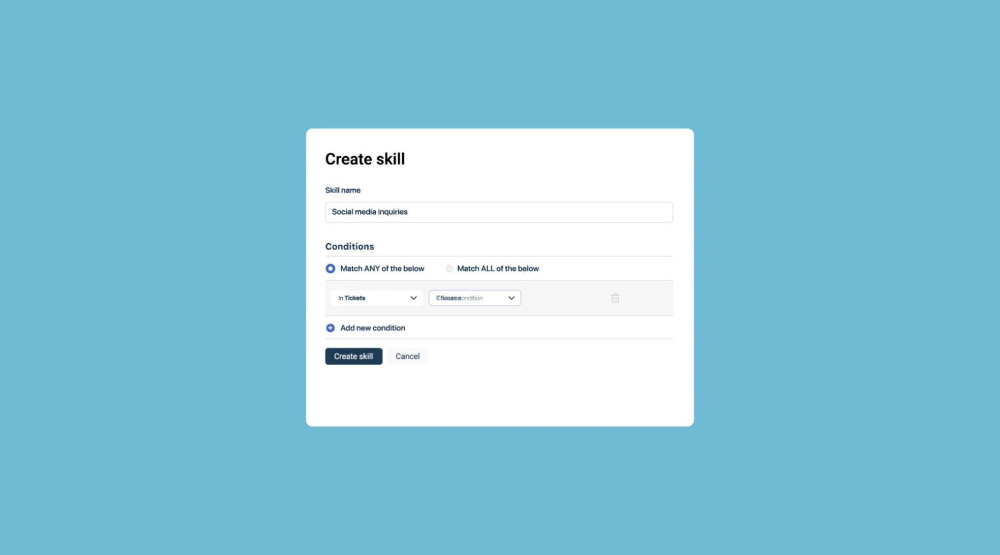

# BONUS: Perfect AI Partner

If you're managing **customer relationships**, tools like **HubSpot CRM**, **Zoho CRM**, and **Freshdesk** can simplify the process and help you stay organized. 

[**HubSpot CRM**](https://www.hubspot.com) is a free tool that lets you track customer interactions, manage deals, and automate follow-ups, making it perfect for small businesses. 

[**Zoho CRM**](https://www.zoho.com/projects/) offers affordable plans that help you manage sales, leads, and customer data all in one place, with helpful features like AI-powered insights. 

[**Freshdesk**](https://www.freshworks.com/freshdesk/) brings together customer support and CRM features, allowing you to track inquiries and provide quick responses—all within a single platform.

