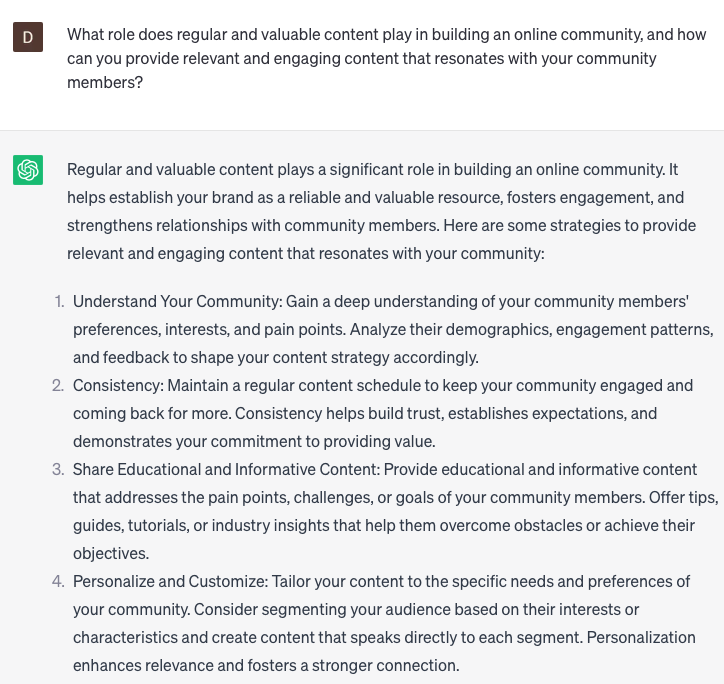

# Build an online community

### FILL-IN-THE-BLANK **PROMPTS**

```jsx
What are the key steps to building a thriving online community in **[industry]**? Discuss the importance of **[defining a clear purpose or mission], [creating engaging content and discussions]**, and **[fostering active participation and connection]** to cultivate a vibrant and supportive online community.
```

```jsx
How can businesses effectively nurture an engaged online community? Explore the significance of **[encouraging user-generated content and discussions]**, and **[rewarding community contributions]** to build a sense of belonging and foster long-term engagement.
```

```jsx
Share **[number]** practical strategies for growing and sustaining an online community. Discuss the effectiveness of **[providing valuable resources and exclusive content]** and **[promoting meaningful interactions and collaboration]** to attract new members and foster a strong sense of community among existing members.
```

### QUESTIONS-BASED P**ROMPTS:**

1. What are some effective strategies to build and nurture an online community that fosters meaningful connections and engagement among your audience?
2. How can you create a sense of belonging and encourage active participation within your online community, fostering a supportive and collaborative environment?
3. What techniques can you use to identify and attract like-minded individuals who align with your brand values and are likely to engage in your online community?
4. How can you leverage social media groups, forums, or dedicated platforms to provide a space for your community members to connect, share insights, and engage with your brand?
5. What role does regular and valuable content play in building an online community, and how can you provide relevant and engaging content that resonates with your community members?
6. How can you encourage community interaction and conversation through activities such as contests, challenges, or discussion prompts that spark engagement and foster connections?
7. What are some effective ways to facilitate two-way communication and actively listen to your community members, making them feel heard and valued?
8. How can you empower your community members to become brand advocates and ambassadors, promoting positive word-of-mouth and expanding the reach of your community?
9. What methods can you use to recognize and appreciate active community members, such as featuring user-generated content or hosting exclusive events or rewards?
10. How can you measure the growth and health of your online community, and what strategies can you employ to continuously improve and evolve your community-building efforts based on community feedback and insights?

### EXAMPLES:

