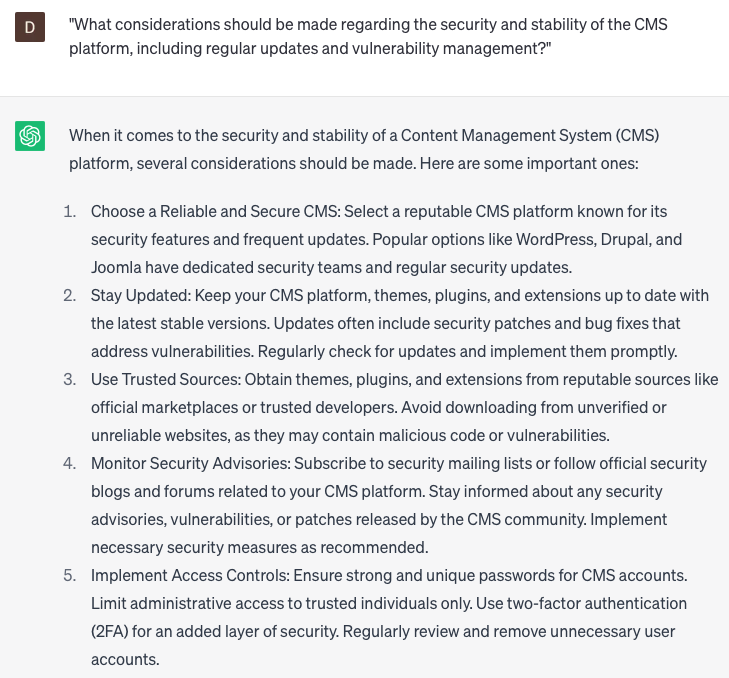

# Choose CMS platform

### FILL-IN-THE-BLANK **PROMPTS:**

```jsx
Which CMS platform would you recommend as the most suitable choice for a **[website type]**? I'm specifically seeking a platform that incorporates **[features]** and supports **[integrations]**.
```

```jsx
Keeping in mind the 'Technology Acceptance Model', which CMS platform would you recommend to support **[languages]** and **[SEO optimization]** for a **[website type]**, and why?
```

```jsx
Could you please present a comparison of CMS platforms that are well-suited for a **[website type]**? It is important for me to assess factors such as **[factor 1], [factor 2],** and **[factor 3]** when making my decision.
```

### QUESTIONS-BASED P**ROMPTS:**

1. "What factors should be considered when selecting a CMS platform that best suits our website's needs and objectives?"
2. "How can we determine the scalability and flexibility of a CMS platform to accommodate future growth and changes to our website?"
3. "What are the key features and functionalities that should be evaluated when choosing a CMS platform, such as content management, user permissions, and SEO capabilities?"
4. "Are there any specific integrations or extensions available for the CMS platform that would enhance our website's functionality and user experience?"
5. "How can we assess the ease of use and user-friendliness of different CMS platforms to ensure efficient content creation and management?"
6. "What considerations should be made regarding the security and stability of the CMS platform, including regular updates and vulnerability management?"
7. "Are there any specific performance or speed optimizations that can be achieved with certain CMS platforms, and how do they impact website loading times?"
8. "What is the community and support ecosystem like for the CMS platforms under consideration, and how can it assist in troubleshooting and ongoing maintenance?"
9. "How does the cost and licensing structure of different CMS platforms align with our budget and long-term sustainability goals?"
10. "What case studies or success stories exist for websites similar to ours that have used a specific CMS platform, and what can we learn from their experiences?"

### EXAMPLES:

