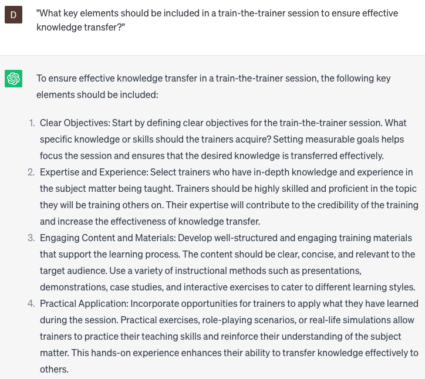

# Conducting train-the-trainer sessions

### FILL-IN-THE-BLANK **PROMPTS:**

```jsx
Please provide suggestions for **[specific type]** activities or exercises that can be included in a train-the-trainer session on **[topic]**. The objective is to achieve **[specific outcome]** while accommodating **[specific need]**.
```

```jsx
Could you please recommend **[specific type]** resources or materials suitable for supplementing a train-the-trainer session on **[topic]**? These resources should meet the criteria of **[specific criterion]**, be appropriate for **[specific audience]**, and incorporate **[specific approach]**.
```

```jsx
Could you please identify common challenges encountered by trainers during train-the-trainer sessions? Additionally, I would appreciate insights on how ChatGPT can contribute to achieving the specific outcomes of **[specific outcome]** and **[specific outcome]**, all while taking into account the factors of **[specific factor]** and **[specific factor]**.
```

### QUESTIONS-BASED P**ROMPTS:**

1. "What key elements should be included in a train-the-trainer session to ensure effective knowledge transfer?"
2. "How can train-the-trainer sessions enhance the expertise and confidence of individuals responsible for delivering training programs?"
3. "What strategies can be employed in train-the-trainer sessions to improve facilitation skills and engagement with learners?"
4. "Why is it important to provide ongoing support and feedback to trainers after conducting train-the-trainer sessions?"
5. "What role does effective communication play in train-the-trainer sessions, and how can it be emphasized during the training process?"
6. "How can train-the-trainer sessions help trainers develop the ability to adapt their teaching methods to different learning styles and preferences?"
7. "What techniques and resources can be utilized in train-the-trainer sessions to promote active learning and participant involvement?"
8. "How can train-the-trainer sessions address the challenges of managing difficult participants or handling unexpected situations during training delivery?"
9. "What are some best practices for assessing the effectiveness of train-the-trainer sessions and measuring the impact on subsequent training programs?"
10. "In what ways can train-the-trainer sessions foster a culture of continuous learning and professional development within an organization?"

### EXAMPLES:

