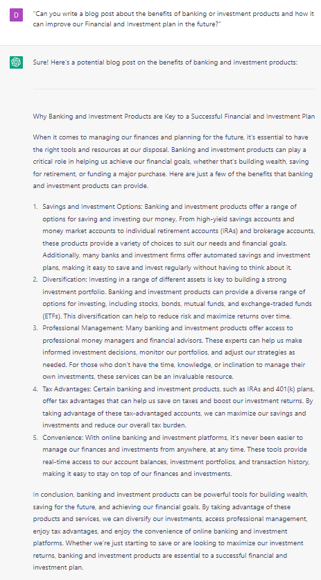

# Crafting Compelling Blog Posts

### FILL-IN-THE-BLANK **PROMPTS:**

```jsx
Can you write a **[word count]** article about **[topic]**, outlining the **[benefits]** of **[product]** for **[reader]**?
```

```jsx
Can you write a blog post **[for/against][subject]** from the perspective of **[ideal customer]**. Before you do so, state the benefits of reading the article.
```

```jsx
Can you write a **[word count]** word article with a **[professional/emotional/exciting/fun]** tone that explains the benefits of **[topic]** for **[reader]**. The article should start by using the PAS formula to compel the reader to read the whole article, and include a call to action in the last paragraph mentioning **[offer]**.
```

### OPEN-ENDED **PROMPTS:**

1. “Can you write a blog post about the benefits of [product/service/idea] and how it can improve [specific area of life/business]?”
2. “Can you create a post that outlines the top trends in [industry/niche] and provides actionable insights on how to stay ahead of the game?”
3. “Can you write a post that addresses common [issue/challenge] faced by [target audience] and offers practical solutions?”
4. “Can you create a post that highlights the success stories of [individuals/organizations] who have made a significant impact in their industry or community?”
5. “Can you write a post that provides a comprehensive guide on how to [achieve specific goal/overcome specific challenge] using step-by-step instructions?”
6. “Can you create a post that analyzes the [history/current state/future] of [industry/niche] and predicts what changes are likely to occur in the near future?”
7. “Can you write a post that offers tips and strategies for [improving specific skill/aspect of life] and provides real-life examples of people who have successfully implemented these strategies?”
8. “Can you create a post that provides an in-depth review of a [product/service] and offers an honest assessment of its benefits and drawbacks?”
9. “Can you write a post that addresses common misconceptions or myths about [topic/industry] and provides accurate information to dispel these misconceptions?”
10. “Can you create a post that profiles a [prominent figure/innovator] in [industry/niche] and provides insights into their career trajectory, achievements, and success strategies?”

### EXAMPLES**:**



```jsx
**TIP:** Remember to give ChatGPT as much context as possible. Details like your specific goals, target audience, and tone will ensure that the resulting blog post is relevant and high-quality.
```