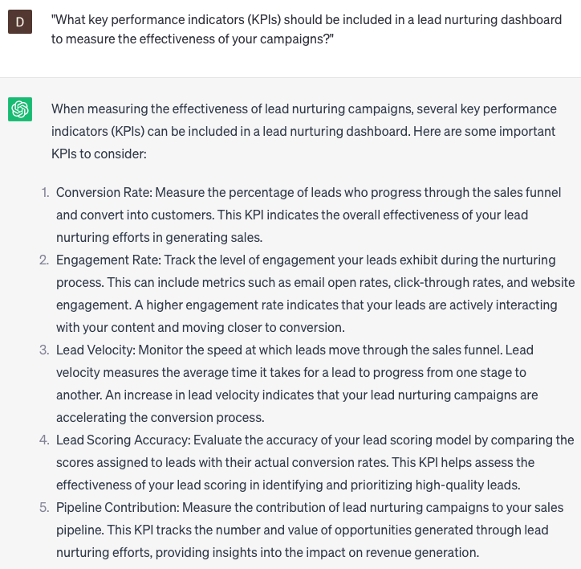

# Crafting lead nurturing KPI dashboards

### FILL-IN-THE-BLANK **PROMPTS:**

```jsx
What are the most successful lead nurturing campaigns and channels utilized by **[company name]** in the previous **[time period]**, and how can we leverage this data to optimize our lead nurturing strategy for the upcoming **[event/product launch]?**
```

```jsx
How can we effectively analyze and interpret our lead nurturing **[KPI data]** to extract valuable insights that will enable us to enhance our campaigns, increase engagement, and drive higher conversion rates? What are the recommended best practices for leveraging this data to continuously improve our efforts?
```

```jsx
What steps can we take to seamlessly integrate our lead nurturing **[KPI]** dashboard with our CRM and marketing automation tools, guaranteeing the synchronization and accuracy of data between them?
```

### QUESTIONS-BASED P**ROMPTS:**

1. "What key performance indicators (KPIs) should be included in a lead nurturing dashboard to measure the effectiveness of your campaigns?"
2. "How can you visualize and track lead engagement metrics such as open rates, click-through rates, and conversion rates in your KPI dashboard?"
3. "What metrics can be used to assess the quality of leads generated through your lead nurturing efforts, and how can they be displayed in your dashboard?"
4. "What role does lead progression and advancement through the sales funnel play in your lead nurturing KPI dashboard?"
5. "How can you incorporate revenue-related metrics, such as lead-to-customer conversion rate and customer lifetime value, into your lead nurturing dashboard?"
6. "What are some effective ways to display and monitor the performance of different lead nurturing campaigns or sequences in your KPI dashboard?"
7. "How can you track and measure the impact of lead nurturing on customer retention and repeat purchases in your KPI dashboard?"
8. "What metrics and visualizations can be used to analyze the efficiency and cost-effectiveness of your lead nurturing efforts?"
9. "How can you leverage marketing automation data to provide real-time updates and insights in your lead nurturing KPI dashboard?"
10. "What strategies can be employed to continuously optimize your lead nurturing KPI dashboard and align it with your business objectives?"

### EXAMPLES:

