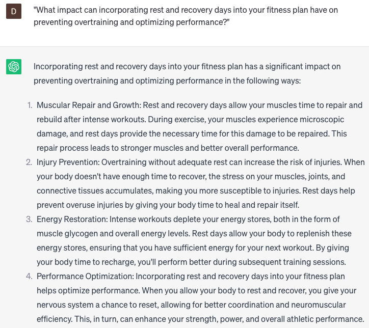

# Create a fitness plan

### FILL-IN-THE-BLANK **PROMPTS:**

```jsx
Could you develop a customized fitness plan for me, taking into account my current fitness level **[current fitness level]**, desired goals **[desired goals]**, and lifestyle habits **[lifestyle habits]**? Please include a workout routine, dietary recommendations, and lifestyle tips to support me in achieving optimal health and wellness.
```

```jsx
What are some key components to consider when creating a personalized fitness plan for **[specific individual]**?
```

```jsx
Could you suggest appetizing and nutritious meal choices that are in line with my **[dietary preferences]** and contribute to my fitness objectives?
```

### QUESTIONS-BASED P**ROMPTS:**

1. "How can creating a personalized fitness plan tailored to your goals and preferences set you up for success on your fitness journey?"
2. "What role does setting specific and realistic fitness goals play in designing an effective and motivating fitness plan?"
3. "In what ways can identifying your current fitness level and assessing your strengths and areas for improvement guide the development of your fitness plan?"
4. "What benefits can be gained from incorporating a variety of exercises, such as cardio, strength training, and flexibility training, into your fitness plan?"
5. "How does scheduling your workouts and prioritizing consistency contribute to staying accountable and making progress towards your fitness goals?"
6. "What strategies can individuals employ to stay motivated and overcome obstacles when implementing their fitness plan?"
7. "How can tracking your progress and celebrating milestones along the way provide a sense of achievement and reinforcement of your fitness plan?"
8. "What impact can incorporating rest and recovery days into your fitness plan have on preventing overtraining and optimizing performance?"
9. "What are the advantages of seeking guidance from a certified fitness professional to help design and refine your fitness plan?"
10. "How does adapting and adjusting your fitness plan over time based on your changing goals and progress support long-term success and continued growth?"

### EXAMPLES:

