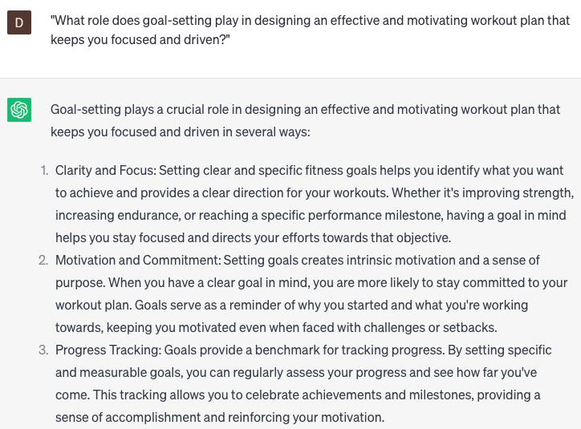

# Create a workout plan

### FILL-IN-THE-BLANK **PROMPTS:**

```jsx
Could you assist me in developing a workout plan to enhance my **[fitness goal]** in preparation for my upcoming **[event]**?
```

```jsx
For **[specific individual]**, what factors should be taken into account when designing an effective workout plan?
```

```jsx
I'm seeking to introduce some variety into my existing workout routine **[your workout routine]**. Could you recommend new exercises or variations to incorporate?
```

### QUESTIONS-BASED P**ROMPTS:**

1. "How can developing a well-rounded workout plan that targets different muscle groups and fitness components contribute to achieving your fitness goals?"
2. "What role does goal-setting play in designing an effective and motivating workout plan that keeps you focused and driven?"
3. "In what ways can understanding your current fitness level and capabilities guide the selection and progression of exercises in your workout plan?"
4. "What benefits can be gained from incorporating both cardiovascular exercises and strength training into your workout plan to improve overall fitness and body composition?"
5. "How does scheduling your workouts and establishing a consistent routine help you stay accountable and make progress towards your fitness goals?"
6. "What strategies can you employ to ensure proper warm-up and cool-down exercises are incorporated into your workout plan to prevent injury and enhance recovery?"
7. "How can incorporating variety and novelty, such as trying new exercises or workout formats, keep your workout plan exciting and prevent boredom?"
8. "What impact can monitoring and tracking your progress, such as tracking weights lifted or recording workout duration, have on assessing your improvement and adjusting your workout plan?"
9. "What are the advantages of seeking guidance from a certified fitness professional in creating a tailored workout plan that aligns with your goals and abilities?"
10. "How does allowing for rest and recovery days in your workout plan contribute to muscle repair, growth, and overall performance?"

### EXAMPLES:

