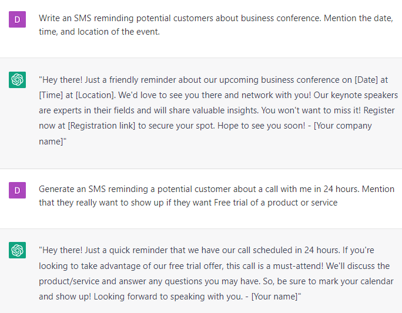

# Creating SMS reminders and follow-up messages for customers

### FILL-IN-THE-BLANK **PROMPTS:**

```jsx
Write an SMS reminding potential customers about **[event]**. Mention the date, time, and location of the event.
```

```jsx
Generate an SMS reminding a potential customer about a call with me in 24 hours. Mention that they really want to show up if they want **[result or bonus].**
```

```jsx
Create an SMS campaign with 5 messages after someone books an appointment with **[type of business]**, mentioning the benefits of going to the appointment.
```

### OPEN-ENDED **PROMPTS:**

1. “Can you help me create SMS reminders for my customers to sell [product] and follow-up messages to ensure they complete [the desired action]?”
2. “Could you write some SMS reminders that encourage my customers to take action on [fill in the blank]?”
3. “Please help me create SMS reminders that highlight the benefits of [product] and encourage [audience] to try it out.”
4. “I need to create SMS reminders that make my customers feel valued and appreciated. Can you help me with that, using [benefit/discount] as a focus?”
5. “Please write some SMS reminders that clearly explain the benefits of using [product] and why it's worth the investment.”
6. “Can you create SMS reminders that are friendly and personable while also encouraging customers to take action on [offer]?”
7. “I want to create SMS reminders that appeal to [specific audience] and highlight how [product] can make their lives easier. Can you help me with that?”

### **EXAMPLES:**

