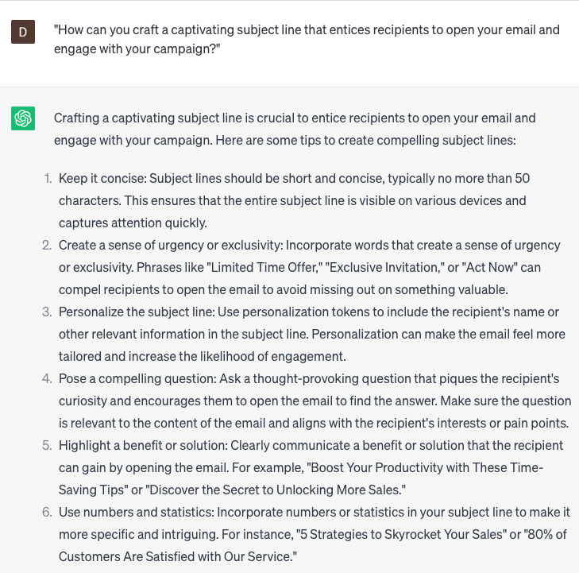

# Creating email marketing campaigns

### FILL-IN-THE-BLANK **PROMPTS:**

```jsx
Can you assist me in devising a captivating subject line to capture the interest of my **[targeted audience]** who have an interest in **[product/service]**?
```

```jsx
As we strive to create effective email marketing campaigns, how can we leverage **[customer data/behavior insights]** to tailor our email messages and offers to specific **[audience segments]**?
```

```jsx
To stand out in a crowded inbox, our email marketing campaigns need to be visually appealing and mobile-friendly. How can we incorporate **[responsive email design/eye-catching visuals/compelling call-to-action buttons]** to optimize the performance of our email campaigns? Consider A/B testing **[subject lines/email layouts/content formats]** to continuously improve **[open rates/click-through rates]**.
```

### QUESTIONS-BASED P**ROMPTS:**

1. "How can you craft a captivating subject line that entices recipients to open your email and engage with your campaign?"
2. "What strategies can you employ to segment your email list and personalize your email content for better targeting and higher engagement?"
3. "How do you create compelling and persuasive email copy that effectively communicates your message and drives desired actions?"
4. "What techniques can you use to design visually appealing and mobile-responsive email templates that enhance the overall user experience?"
5. "How can you strategically incorporate persuasive calls-to-action (CTAs) in your email campaigns to drive conversions and achieve your campaign goals?"
6. "What methods can you employ to optimize your email deliverability and avoid common pitfalls, such as being flagged as spam?"
7. "How do you leverage automation and drip campaigns to nurture leads, build relationships, and improve conversion rates over time?"
8. "What strategies can you use to analyze and interpret email marketing metrics, such as open rates and click-through rates, to measure the success of your campaigns?"
9. "How can you effectively A/B test different elements of your email campaigns, such as subject lines or CTAs, to optimize performance and improve results?"
10. "What techniques can you employ to maintain a consistent brand voice and image throughout your email marketing campaigns for enhanced brand recognition and customer loyalty?"

### EXAMPLES:

