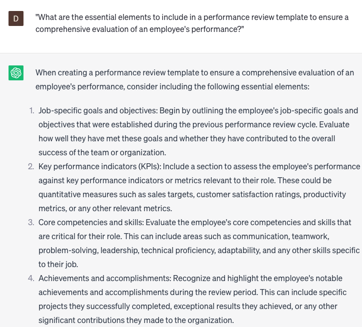

# Creating performance review templates

### FILL-IN-THE-BLANK **PROMPTS:**

```jsx
Could you assist me in developing a performance review template for **[job title]**? It is vital that the template encompasses all the essential competencies and performance indicators necessary for this position, including **[competency], [competency]**, and **[competency]**. Moreover, I aim to evaluate **[soft skill or attribute]** and **[soft skill or attribute]** within this role. Can you generate prompts that would aid in assessing these skills and offering constructive feedback to my employees?
```

```jsx
I require assistance in composing a performance review for **[employee name]**, with a focus on delivering comprehensive and constructive feedback. Could you please provide me with prompts and feedback examples to structure the review and address areas requiring improvement? In particular, I aim to evaluate **[skill or attribute]** and **[skill or attribute]**. It would be greatly appreciated if you could generate prompts to aid in assessing these skills and offering feedback that would support the employee's performance improvement.
```

```jsx
I seek assistance in developing a performance review that centers around **[specific goal or project]**, encompassing **[task or responsibility]**. Could you aid me in creating a template that comprehensively addresses the key accomplishments and areas requiring improvement related to this goal, while also providing feedback on specific skills like **[skill], [skill]**, and **[skill]**? Furthermore, I aim to evaluate **[soft skill or attribute]** and **[soft skill or attribute]** in my employees. Would you be able to generate prompts that facilitate the assessment of these skills and enable the provision of constructive feedback?
```

### QUESTIONS-BASED P**ROMPTS:**

1. "What are the essential elements to include in a performance review template to ensure a comprehensive evaluation of an employee's performance?"
2. "How can a performance review template be designed to align with the specific goals and objectives of the organization?"
3. "What criteria should be incorporated into a performance review template to assess an employee's job-specific skills and competencies?"
4. "In what ways can a performance review template capture and measure an employee's contributions to team collaboration and cooperation?"
5. "How can a performance review template facilitate a fair and unbiased assessment of an employee's performance, ensuring objectivity in the evaluation process?"
6. "What strategies can be utilized in a performance review template to provide constructive feedback and help employees identify areas for improvement?"
7. "What methods can be employed in a performance review template to recognize and acknowledge an employee's exceptional achievements and outstanding performance?"
8. "How can a performance review template incorporate goal-setting and performance development plans to encourage employee growth and advancement?"
9. "What approaches can be included in a performance review template to evaluate an employee's adaptability, problem-solving skills, and ability to handle challenging situations?"
10. "What steps should be taken when creating a performance review template to ensure its flexibility and suitability for different roles and departments within the organization?"

### EXAMPLES:

