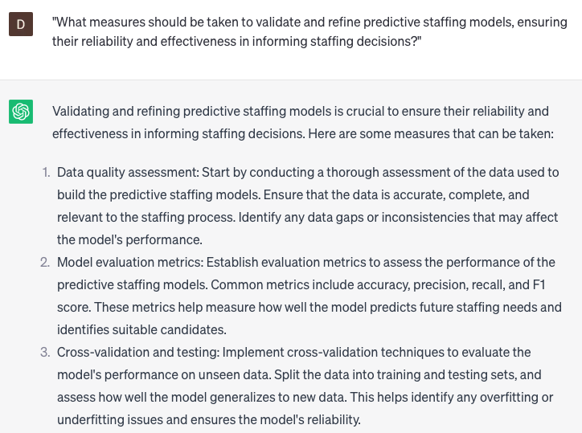

# Creating predictive staffing models

### FILL-IN-THE-BLANK **PROMPTS:**

```jsx
Could you assist me in developing a predictive staffing model for my **[specific industry]** business? The objective is to forecast our future staffing requirements by considering **[specific criteria]** while incorporating **[additional criteria]** such as **[specific variable], [specific variable],** and **[specific variable]**. Additionally, it is crucial that the model incorporates **[specific considerations]** to ensure accurate predictions.
```

```jsx
I seek guidance on optimizing the staffing levels for my **[specific type of operation]** by determining the appropriate number of staff members required at different times of the day/week, considering factors such as **[specific variable]**, **[specific variable]**, and **[specific variable]**. Additionally, I aim to enhance the accuracy of the model by incorporating **[additional factors]** such as **[specific variable]** and **[specific variable]**.
```

```jsx
Could you furnish me with real-time staffing recommendations for my **[specific type of business]** based on the latest **[specific data points]**, including **[additional data points]** like **[specific variable]** and **[specific variable]**? It is imperative that we can promptly adapt our staffing levels to meet demand while considering **[specific considerations]** such as **[specific variable]**.
```

### QUESTIONS-BASED P**ROMPTS:**

1. "Why is creating predictive staffing models valuable for organizations to anticipate future talent needs and optimize workforce planning?"
2. "What data sources and variables should be considered when developing predictive staffing models to forecast staffing requirements?"
3. "How can predictive staffing models incorporate external factors, such as market trends, industry growth, or regulatory changes, to provide a holistic view of future staffing needs?"
4. "In what ways can predictive staffing models help organizations identify potential skills gaps and develop proactive strategies for talent acquisition and development?"
5. "What statistical techniques and algorithms can be utilized in creating predictive staffing models to analyze historical data and generate accurate predictions?"
6. "How can predictive staffing models take into account workforce demographics, turnover rates, and employee engagement metrics to assess future workforce stability?"
7. "What measures should be taken to validate and refine predictive staffing models, ensuring their reliability and effectiveness in informing staffing decisions?"
8. "How can predictive staffing models support workforce optimization, enabling organizations to allocate resources efficiently and minimize labor costs?"
9. "What role can scenario analysis and sensitivity testing play in predictive staffing models to evaluate different workforce planning scenarios and their potential impact?"
10. "How can organizations ensure ethical and fair use of predictive staffing models, considering factors such as diversity, equal opportunity, and potential biases?"

### EXAMPLES:

