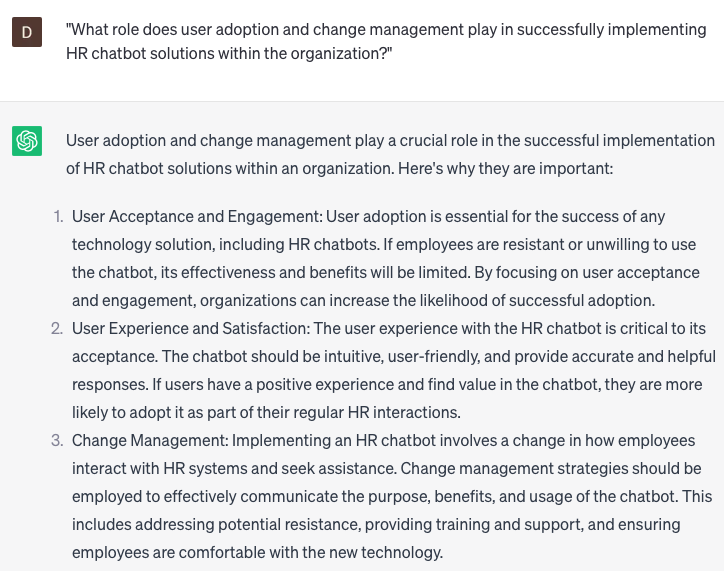

# Developing HR chatbot solutions

### FILL-IN-THE-BLANK **PROMPTS:**

```jsx
Please compile a list of prospective job candidates who meet the required qualifications for the open position of **[insert job title]**. This list should include their relevant experience, education background, and any applicable skills.
```

```jsx
Please utilize **[insert job search website]** to explore individuals possessing **[specific skills or experience]**. Compile their contact details alongside pertinent background information.
```

```jsx
Could you furnish a compilation of industry events and job fairs within **[insert location]** that might feature prospective job candidates suitable for a **[insert job title]** role?
```

### QUESTIONS-BASED P**ROMPTS:**

1. "What are the key considerations organizations should keep in mind when developing HR chatbot solutions to effectively address employee inquiries and enhance the employee experience?"
2. "How can organizations identify and prioritize the HR processes and tasks that can be effectively automated and supported by chatbot solutions?"
3. "What role does natural language processing (NLP) and machine learning play in creating intelligent and user-friendly HR chatbot solutions?"
4. "How can organizations ensure that HR chatbot solutions maintain data privacy and security while handling sensitive employee information?"
5. "What strategies can organizations employ to design HR chatbots that provide personalized and accurate responses, tailored to individual employee needs?"
6. "How can organizations effectively train and update HR chatbot solutions to ensure they stay up-to-date with evolving HR policies, procedures, and information?"
7. "What measures should organizations take to incorporate feedback and user insights when refining and improving HR chatbot solutions?"
8. "How can organizations integrate HR chatbot solutions with existing HR systems and technologies to streamline processes and enhance overall efficiency?"
9. "What role does user adoption and change management play in successfully implementing HR chatbot solutions within the organization?"
10. "How can organizations measure the effectiveness and impact of HR chatbot solutions in terms of improved employee satisfaction, reduced HR workload, and overall organizational performance?"

### EXAMPLES:

