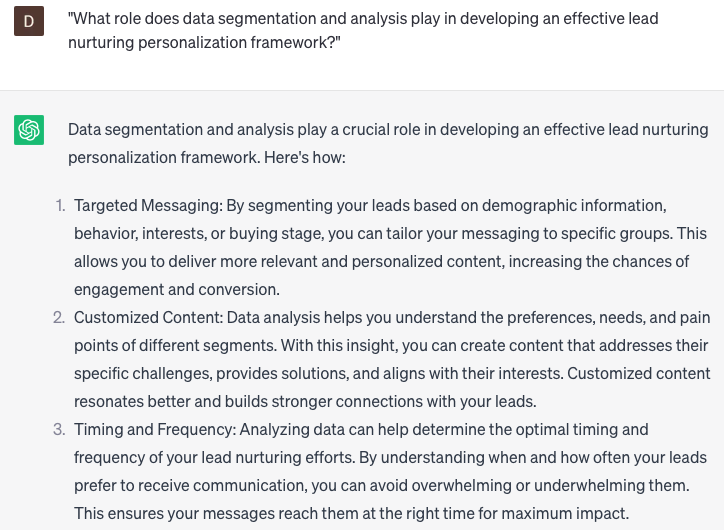

# Developing lead nurturing personalization frameworks

### FILL-IN-THE-BLANK **PROMPTS:**

```jsx
I require assistance in building a lead nurturing personalization framework for **[company name]**'s course, specifically targeting healthcare executives and IT professionals. Can you propose strategies for personalizing our messaging based on each lead's role **[role placeholder]**, pain points **[pain point placeholder]**, and past behavior **[past behavior placeholder]**, as well as provide recommendations for automating the personalization process **[automation placeholder]**?
```

```jsx
Can you assist me in developing a content personalization strategy **[content personalization placeholder]** for creating a customized email campaign targeting financial analysts and bankers for **[company name]** course? The strategy should emphasize the advantages of AI in finance and incorporate tailored examples of how AI has positively impacted companies within the industry **[customized examples placeholder].**
```

```jsx
Could you help me automate the personalization of our lead nurturing campaigns for **[company name]** course by utilizing marketing automation workflows **[automation workflow placeholder]**? I'm seeking recommendations on how to configure these workflows based on each lead's behavior, interests, and demographics **[behavior, interests, and demographics placeholder]**, as well as how to optimize the workflows for improved engagement and conversions **[optimization placeholder]**.
```

### QUESTIONS-BASED P**ROMPTS:**

1. "How can you create a lead nurturing personalization framework that delivers tailored and relevant content to each individual lead?"
2. "What role does data segmentation and analysis play in developing an effective lead nurturing personalization framework?"
3. "How can you leverage customer behavior and engagement data to personalize lead nurturing campaigns and communication?"
4. "What strategies can be used to dynamically adjust and adapt lead nurturing content based on real-time customer interactions?"
5. "How can you incorporate personalization tokens and dynamic content blocks within your lead nurturing emails to enhance individualized experiences?"
6. "What role does predictive modeling and machine learning algorithms play in optimizing lead nurturing personalization frameworks?"
7. "How can you create a seamless cross-channel personalization experience for leads as they interact with your brand?"
8. "What tactics can be used to personalize lead nurturing content based on the lead's specific pain points, challenges, and goals?"
9. "How can you leverage CRM data and integration to enhance lead nurturing personalization and deliver targeted messaging?"
10. "What strategies can be employed to continuously test, analyze, and iterate your lead nurturing personalization framework for optimal results?"

### EXAMPLES:

