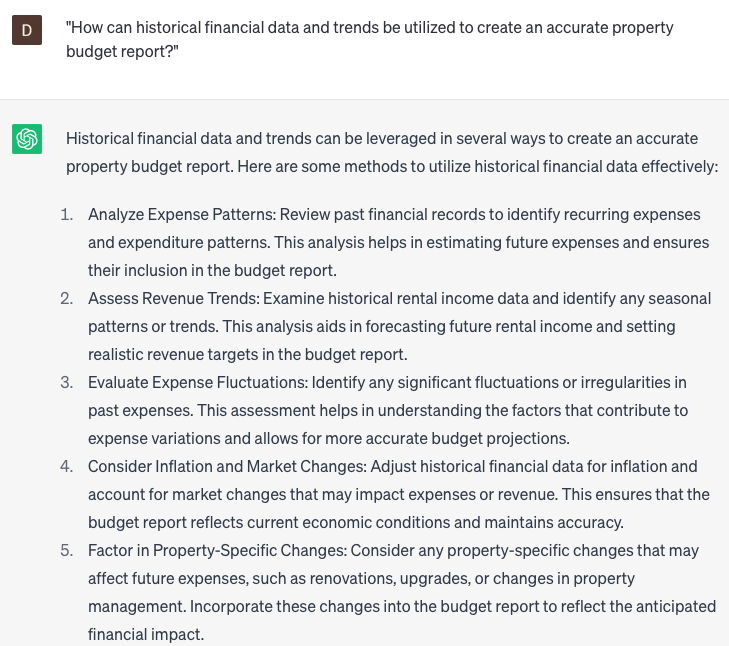

# Developing property budget reports

### FILL-IN-THE-BLANK **PROMPTS:**

```jsx
What effective approaches can be adopted to reduce **[specific expense category]** costs for **[specific property]** in the upcoming fiscal year, leveraging insights from the analysis of previous year's expenses and the current **[market trend]** trends? What potential outcomes or benefits can be expected from implementing these strategies?
```

```jsx
Considering the **[financial performance data]** and **[market research findings]** for the **[specific time period]**, what is the most efficient and effective budget allocation for **[specific property]**? Provide a comprehensive budget report that outlines the different expense categories and their corresponding amounts.
```

```jsx
What are the possible **[financial risks]** involved in investing in **[specific property]**, and what strategies can be employed to **[mitigate]** them? Provide an insightful analysis of the **[financial risk factors]** based on an evaluation of **[past performance]** and an examination of **[market trends]**. Furthermore, what anticipated outcomes or results can be expected by implementing effective risk mitigation measures?
```

### QUESTIONS-BASED P**ROMPTS:**

1. "What are the essential components to include in a comprehensive property budget report?"
2. "How do you determine the appropriate budget allocation for different expense categories in a property budget report?"
3. "What factors should be considered when forecasting income and expenses for a property budget report?"
4. "What strategies can be employed to optimize cost-saving opportunities in a property budget report?"
5. "How can historical financial data and trends be utilized to create an accurate property budget report?"
6. "What methods can be used to monitor and track actual expenses against the budgeted amounts in a property budget report?"
7. "How do you account for unexpected or unforeseen expenses in a property budget report?"
8. "What are the benefits of conducting regular budget reviews and adjustments in a property budget report?"
9. "How can benchmarking and industry comparisons be used to enhance the accuracy and effectiveness of a property budget report?"
10. "What are some best practices for presenting and communicating a property budget report to stakeholders or investors?"

### EXAMPLES:

