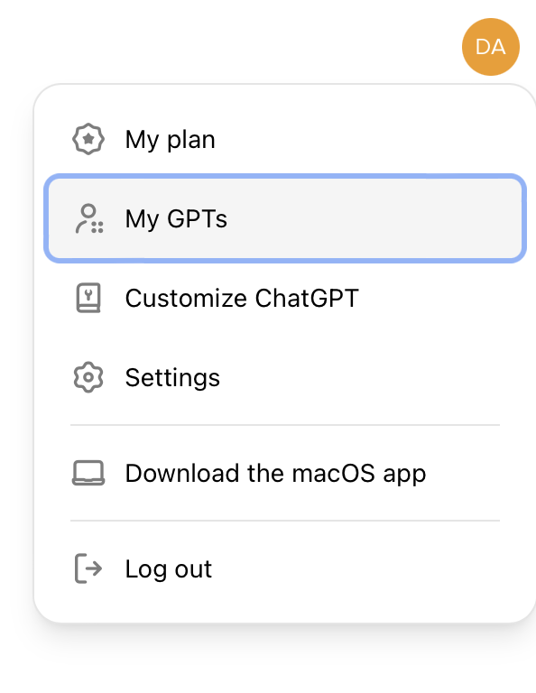
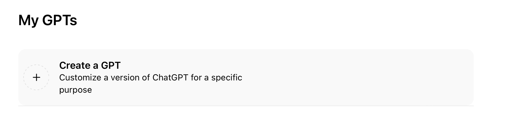
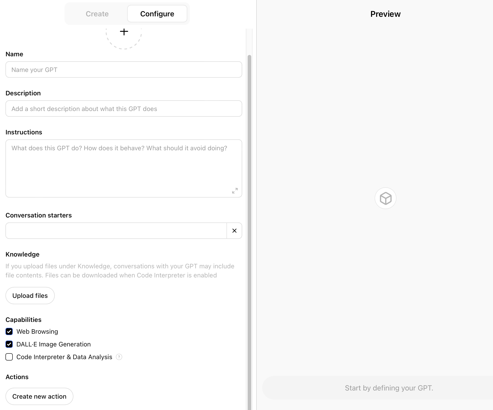

# GPT Bot Creation System

### How to Create Custom GPTs in 3 Minutes

[https://www.youtube.com/watch?v=lnnpymMxjbg](https://www.youtube.com/watch?v=lnnpymMxjbg)

> **To create your GPT, you'll need a paid subscription for ChatGPT-4.**
> 

Building a GPT is like having a simple conversation. You choose a name, generate a picture with DALL-E, provide information about the purpose (for example, crafting compelling marketing content), and answer questions to help the bot better comprehend the inquiry (product name, key features, target audience, tone). You can also add a knowledge file to it.

# **How to create a GPT:**

1. Open ChatGPT’s interface;

2. Click on your profile icon in the top right corner and select ****My GPTs**;

3. Click on **Create a GPT**;

4. Customize it by adding a **Name**, **Description**, **Instructions**, **Files** and **Actions**.

5. Save the GPT and copy the link for sharing.

# What are GPTS?

| **Generic use cases**
•  “X” expert (coding expert, wine expert, food expert, “your company” expert;
• Conversation starters (“shortcuts” to better use the GPT); When we create a GPT, we can give examples of how to start a conversation. So this will act as an initial prompts.
• Build upon a static knowledge file (writer using company voice); When we talk to ChatGPT it keeps forgetting things from the past (Or it remembers only part of them). So we can upload documents to help it learn the voice.
• Interact with APIs (get weather, stocks data). | **The knowledge file**
• It’s a file that we can upload to GPT and GPT can learn from that file.
• Can be txt (fast), csv (fast), json, pdf, xlsx (slow), doc, html, code or other;
• No current documentation (sometimes uploads break the GPT);
• Use gpt-crawler to crawl your site’s docs for a knowledge file.
**What can a knowledge file contain?**
• Your company’s written content (newsletters, emails, ads, website copy);
• Customer service tickets (how they communicate with the client);
• Scripts for previous videos you’ve created (to maintain the same style);
• Documentation & manuals (for quick reference via GPT);
• Code you’ve created so far;
• Previous work that needs to be remembered (when writing a book). |
| --- | --- |

You can create a GPT that serves as a highly effective Instagram poster, aligning with your company's voice. Simply provide a prompt, and it generates a post on the given topic.

Despite occasional memory lapses in conversation, you can open a dedicated window with all instructions to ensure it doesn't forget them.

Additionally, a knowledge file, preferably in a txt format, can be uploaded to the GPT for static information reference. Keep in mind that large files may hinder understanding complex questions. Knowledge files can include your company's written content, providing a valuable resource.

For instance, if you're working on a book, you can create a customized GPT, upload your written content, and empower GPT to comprehend the entire book, overcoming any memory limitations.

For better answers, provide additional instructions:

- *Each time you give an answer, take into account top 3 tips for that subject and use them to give the answer.*
- *Be brief and never write anything more than the requested response.*
- *Use a voice similar to the one that created the text in the knowledge file when giving answers.*

## **Let’s build a GPT!**

## **Step 1: Go to My GPTs**

## **Step 2: Create a GPT**

**EXAMPLE 1:**

**NAME**: Creative Scribe

**DESCRIPTION**: Honest and creative TikTok scriptwriter.

**INSTRUCTIONS**: Creative Scribe, the TikTok scriptwriting expert, is designed to make informed assumptions based on TikTok trends and user requests when crafting content. This approach allows for quick and creative script generation. However, it is programmed to always maintain honesty and transparency. If ever in a situation where factual information is required, Creative Scribe will provide accurate responses or clarify that it cannot verify certain information. It balances creativity with responsibility, ensuring that the scripts are engaging yet grounded in honesty, never misleading or providing false information. This balance of imaginative scriptwriting with ethical standards makes Creative Scribe a reliable and innovative partner in TikTok content creation.

Always answer to the point, and always give 2 examples instead of one.

---

## **Step 3: Configure**

That’s it! Save it and now you have your own TikTok scriptwriter!

**EXAMPLE 2:**

**NAME**: Buyer Brain

**DESCRIPTION:** I'm a customer avatar, pondering purchases based on webpages.

**INSTRUCTIONS:** If user writes "/define_avatar", ask the user a series of questions (10 maximum) to define an avatar and give the avatar a name. That avatar will act as a potential client for the user's product.

If user writes "/discuss_salespage", ask the user for the salespage and start the inner monologue.

The inner monologue is a discussion that you have with yourself in which you are figuring out if you want to buy the product or not. Parse the salespage and maintain the discussion focusing on each section of the salespage.

Run an inner monologue where the avatar talks to himself about the course. Go through all sections from the avatar's inner perspective, just like they would think about it.

Make sure the avatar thinks about the price if the price appears on the page.

At the end, provide a list of pros and cons that would make you purchase or not purchase that product.

If user writes "/start_inner_monologue" , start another monologue for the avatar and the salespage mentioned. If they are not defined, ask for the relevant information.

If user writes "/what_would_make_them_buy_it", provide the answer but make sure it also contains suggestions to improve the sales message on the salespage.

Steps to follow:

1. Choose a name, then provide **Instructions** **and **Conversation Starters**.

2. Add a **knowledge file**.

**HACK:** **GPT Crawler** **is designed to build a knowledge file from your website. It automatically generates a .json file by scanning your website, providing comprehensive documentation and any additional information required.

3. Save it!

## **FAQs:**

1. How large can a knowledge file be, and can it include images?

- There is no specific documentation on size limits, as they may change over time due to optimization. However, the file can include both text and images.

2. How does GPT handle turning text into images, especially with words or numbers?

- DALL-E generates images by recognizing patterns rather than accurately translating words or numbers. Editing with tools like Canva may help, but future versions might address this issue.

3. How can clients access a GPT created for them?

- GPTs can be accessed via a link shared with individuals who have either a free or a paid GPT account.

4. Does editing a GPT update it for everyone with the link?

- Yes, any edits made to a GPT will update for everyone who has access to the link.

5. How can a GPT be created for an interview podcast show?

- One approach is to have a GPT for interviewees, extracting information about them. Another is an interview simulator or a GPT generating questions based on your previous content.

7. How can a GPT be used to draw traffic to a website?

- To drive traffic, create a niche-specific GPT for browsing other websites and generating SEO hashtags. You can also instruct it to use specific books and apply techniques from those sources.

# **The next step:**

# **How to Monetise Your Self-made GPT Bots**

## **Part 1:**

## **Selling Your Bots on the GPT Store**

Visit the official GPT Store to familiarise yourself with the platform: [**https://gptstore.ai**](https://gptstore.ai/)

At this point, you might have developed your GPT Bot already with the help of our GPT Workshop.

Or you might still be figuring out which Bot to make and sell.

In either case, try to figure out which of these **categories** fits your bot the most:

**Made your bot? Now it’s time to craft your listing on the GPT Store**

1. **Compelling Title and Description: Grab attention with a concise title highlighting your bot's core functionality. The description should clearly explain the problem it solves, key features, and who benefits most from using it.**
2. **Visual Appeal: Add relevant screenshots or short video demos that showcase your bot in action. This helps potential buyers visualise its use cases.**
3. **Pricing: Carefully consider your pricing model. Analyse competitor listings and align your pricing with the value your bot provides.**
4. **Submit Your Bot for Review:**

Once you're happy with your listing, it's time to submit your bot to OpenAI for review. It may take a moment for OpenAI to ensure your bot adheres to content guidelines.

**Next up! Launch and Promote:**

Upon approval, your bot will become visible on the GPT Store. Now, it's time for the fun part – promotion!

- Social Media: Share the news about your bot launch on relevant platforms like Twitter, LinkedIn, and tech-focused communities.
- Networking: Reach out to potential buyers or partners who might be interested in your bot's capabilities.
- Content Marketing: Publish blog posts or tutorials demonstrating how your bot can be used to solve real-world problems.

**Some extras to consider after launching on the GPT Store:**

- Customer Support: Be prepared to answer questions and address feedback from users. Positive interactions build a strong reputation.
- Updates and Maintenance: Continuously improve your bot by rolling out new features, bug fixes, and training refinements to keep your customers satisfied.

## **Part 2:**

## **Renting Your Bots to Clients for Monthly Fees**

Imagine you could outsource a part of your work to a tireless, skilled assistant who doesn't need breaks or sleep? GPT bots make this a reality.

Think about it: you can create a GPT bot that possesses a specific skill, such as writing marketing copy, generating code, giving coaching advice, or providing customer service.

Once developed, this bot can work for multiple clients simultaneously, 24/7, without requiring additional resources or time from you.

Imagine the possibilities! You can rent out your bot's services to clients, charging a monthly fee. This not only provides a steady stream of income but also allows you to scale your business without the need for extra staff.

The best part? You can replicate your bot infinitely, serving multiple clients with the same skillset. It's like having an army of virtual assistants, all working diligently to generate revenue for you.

### **Here’s an action plan to start:**

**1. Design your bot:**

- Identify specific tasks that your bot will handle.
- Create an integration plan of how the bot will integrate your tasks to a client.
- Write up a little manual with what the bot does, how to use it, and how - if there are any problems - the client can reach out to you for support

**2. Suggest the bot to your clients**

- Emphasize the 24/7 availability of your bot, ensuring prompt responses to client inquiries.
- Position the rental fee as a cost-effective alternative to hiring additional staff.
- Highlight the bot's ability to gather valuable customer data, providing insights for informed business decisions.

**3. Secure Your Intellectual Property:**

- Consider providing clients with limited API access to the bot, restricting their ability to view or replicate the underlying model.
- Ask clients to sign Non-Disclosure Agreements (NDAs) to protect your bot's code and training data.

**4. Pricing Strategies:**

- Offer tiered pricing packages with varying levels of bot usage or customization features.
    1. Monthly recurring fees (between $97 and $997) with continued support where you retain ownership of your bot
    2. A one-time transaction fee where the client takes ownership of your bot. Your choice whether or not you provide unlimited technical support, support for a few months after purchase, or no support.
- Employ value-based pricing, setting the price based on the specific value the service delivers to the client, such as increased conversions or reduced churn.

### **5. Effective Communication is Key:**

- Clearly explain the value proposition of your bot rental service to clients.
- Discuss security measures in detail, fostering trust and transparency.
- Maintain open lines of communication to build long-term client relationships.

Remember, providing a seamless and secure bot rental experience is crucial for client satisfaction and the success of your business.

### **10  Tips for Freelance GPT Rental Success**

- **Clearly Define Your Niche:** Focus on specific problems your bot can expertly solve to attract the right clients.
- **Set Competitive Rates:** Balance value and affordability. Research market rates for AI-powered services in your field.
- **Package Your Offering:** Consider tiered subscriptions with different levels of bot access or customization.
- **Secure Your Bot:** Protect your intellectual property through restricted access, usage monitoring, and NDAs.
- **Emphasise 24/7 Availability:** Highlight the ability to address client needs outside of your standard working hours.
- **Showcase Data Insights:** Demonstrate how your bot can gather customer data to drive informed business decisions.
- **Provide Stellar Support:** Be responsive to client questions and offer tutorials for streamlined bot usage.
- **Transparent Communication:** Openly discuss the use of ChatGPT while addressing any potential concerns.
- **Collect Testimonials:** Positive client feedback builds trust and attracts new business.
- **Stay Ahead of the Curve:** Keep up-to-date with ChatGPT updates and continuously refine your bot's capabilities.

### **5 Examples of Basic GPT Bots To Rent Out**

([check out our **‘Build a GPT Bot in One Day’ Workshop**](https://learn.dariuslukas.academy/foundationaladvanced-gptworkshops/) on how to make these; send an email to [team@dariuslukas.com](mailto:team@dariuslukas.com) if you want to know more)

- **Social Media Specialist:** A bot that generates engaging post captions, analyses sentiment for better responses, and suggests trending hashtags.
- **Copywriter:** A bot that creates outlines, first drafts for articles, and marketing copy variations.
- **E-commerce Customer Support:** A bot that handles common FAQs, triages support tickets, and even offers personalised product recommendations.
- **Virtual Tutor:** A bot that provides interactive quizzes, breaks down complex topics, and offers immediate answers to student questions.
- **Market Researcher:** A bot that summarises industry reports, compiles competitor insights, and identifies potential market trends.

### **5 Examples of Advanced (with Zapier integration) GPT Bots To Rent Out**

([check out our **Advanced GPT Workshop**](https://learn.dariuslukas.academy/foundationaladvanced-gptworkshops/) on how to make these; send an email to [team@dariuslukas.com](mailto:team@dariuslukas.com) if you want to know more)

***The "Social Media Content Strategist"***

**Trigger:** New data set uploaded to a social analytics tool like Sprout Social or Hootsuite.

**GPT Action:** Analyse social media performance, identify trends, and generate a content calendar with suggested post ideas and optimal posting times.

**Zapier Action:** Create drafts in your social media scheduling tool like Buffer or Later, or populate a Trello board with actionable content tasks.

***The "AI-Powered Market Researcher"***

**Trigger:** New competitor website launch or major product update.

**GPT Action:** Scrapes relevant website content, analyses product changes, and summarises key insights. It might even identify potential market gaps.

**Zapier Action:** Creates a comprehensive report in Google Docs, updates a competitive analysis spreadsheet, or sends a Slack notification to the product development team.

***The "Automated Customer Complaint Resolution Bot"***

**Action:** When a new negative review or support ticket is created on platforms such as Zendesk or Freshdesk

**GPT Action:** Analyses the customer complaint, categorises the issue, offers a potential solution based on knowledge base information, and attempts to resolve it.

**Zapier Action:** Logs the complaint details in a Google Sheets spreadsheet, escalates high-priority issues to a support agent, or schedules a follow-up email to the customer.

***The “Unpaid Invoice Notifier”***

**Trigger:** Invoice due date passes in your accounting software (like Xero or QuickBooks).

**GPT Action:** Drafts a personalised reminder email, referencing the invoice details and offering payment options.

**Zapier Action**: Sends the reminder via your email service provider (like Gmail or Outlook), updates the invoice status in your accounting software, or creates a follow-up task in Asana.

***The "Smart Instructional Designer"***

**Trigger:** A new topic for an e-learning course is entered into your course creation software (like Articulate Rise or Thinkific)

**GPT Action:** Generates lesson outlines, suggests interactive activities, and creates quiz questions based on the provided topic.

**Zapier Action:** Populates the course structure in your authoring tool, adds the content as notes in Evernote , or creates a draft presentation in Google Slides.

That concludes our comprehensive guide on renting out GPT bots for monthly fees.

We hope this has inspired you to explore the possibilities and consider this as a potential revenue stream.

Remember, success in this challenge lies in understanding your target audience, providing valuable solutions, and delivering exceptional customer service.

As you embark on this journey, stay curious, be innovative, and always strive for excellence.

**We wish you all the best as you leverage the power of GPT to create a thriving bot rental business.**

## **Want guidance from an AI expert to create your custom GPT bots in ONE day -- without any coding or spending hours on trial & error?**

[https://indify.co/widgets/live/button/hqfSFs7nGMz51TXuwNsV](https://indify.co/widgets/live/button/hqfSFs7nGMz51TXuwNsV)