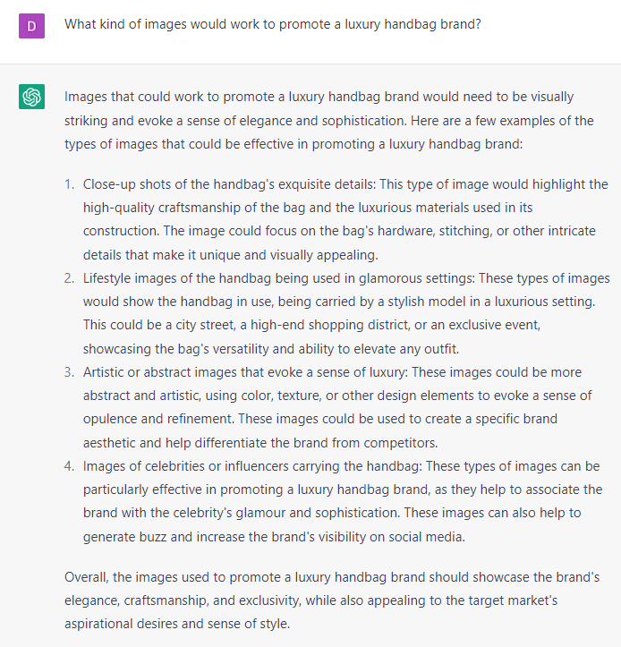

# Generating Ideas for Creatives

### FILL-IN-THE-BLANK PROMPTS**:**

```jsx
Prompt 1: What kind of images would work to promote **[product]**?

Prompt 2: List the adjectives of **[the image or scene you chose].**

Prompt 3: Describe in detail **[the image or scene you chose].**

Input all that information into an AI Art Generator like Dall-E or Midjourney.
```

### OPEN-ENDED **PROMPTS:**

1. “Can you suggest some unique and eye-catching images that could grab the attention of my target audience?”
2. “What are some creative ways to visually represent the benefits of my product/service in an advertisement?”
3. “How can I use images to convey a specific emotion or feeling that resonates with my target audience?”
4. “Can you help me come up with a visual concept that aligns with my brand's values and messaging?”
5. “What kind of visual storytelling techniques can I use to make my advertisement more engaging and memorable?”
6. “Can you suggest some trending graphic design styles that could work well for my advertisement?”
7. “How can I use color psychology to create an advertisement that resonates with my target audience and drives conversions?”
8. “Can you help me create a visual narrative that tells a story and connects with my target audience on a deeper level?”
9. “How can I incorporate user-generated content or social proof into my advertisement visuals to boost credibility?”
10. “What kind of visual metaphors or symbols could I use to create a powerful and memorable advertisement?”

### EXAMPLES:



