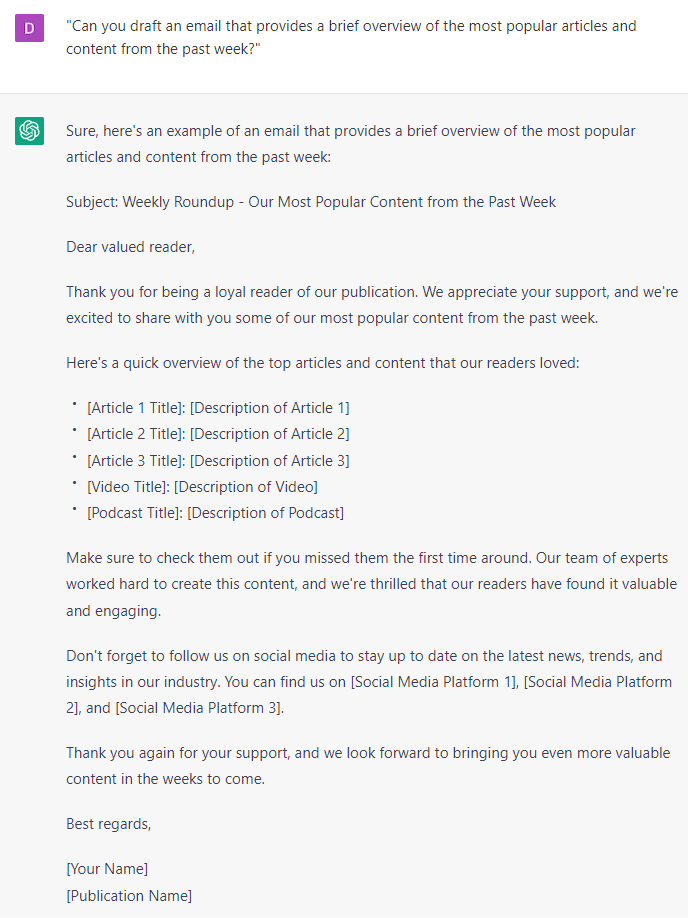

# Generating a Newsletter

### FILL-IN-THE-BLANK **PROMPTS:**

```jsx
Prompt 1: Analyze the tone of voice and writing style of this text: **[insert a text that represents your tone of voice and writing style]**

Prompt 2: Use that tone of voice and writing style for writing an email that **[describe email]**
```

```jsx
Generate a weekly newsletter email for potential customers that includes:

Greeting: Hi **[recipient name]**,
Update: We have exciting news for you!
Content: Our **[insert your something you want to showcase]** is live and you can take a look here **[include link]**
Benefits: This will help you **[insert your first benefit]**, **[insert your second benefit]**, and **[insert your third benefit]**.
Call-to-action: If you want to **[main benefit]** without **[main objection]**, this is definitely for you.
Sign-off: Talk to you next week, **[insert your name].**
```

### QUESTION-BASED **PROMPTS:**

1. "Write a weekly newsletter email for our customers that highlights new products, promotions, and events."
2. "Can you draft an email that provides a brief overview of the most popular articles and content from the past week?"
3. "Write a weekly newsletter email that showcases customer success stories and testimonials."
4. "Can you compose an email that includes industry news and trends relevant to our customers?"
5. "Write a weekly newsletter email that offers tips and resources to help customers achieve their goals."
6. "Can you create an email that features special promotions and discounts for our products and services?"
7. "Write an email that highlights upcoming events, webinars, and workshops for our customers."
8. "Can you draft an email that provides a sneak peek of new products and features in development?"
9. "Write a weekly newsletter email that showcases user-generated content and encourages customer engagement."
10. "Can you create an email that concludes by expressing gratitude for the customer's support and reiterating our commitment to their success?"

### EXAMPLES:

