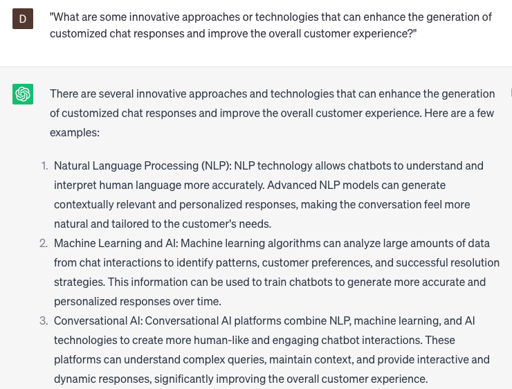

# Generating customized chat responses

### FILL-IN-THE-BLANK **PROMPTS:**

```jsx
I require assistance regarding **[the specific product or service]** provided by **[the company name]**. Specifically, I am encountering difficulties with **[the specific issue you're experiencing]**. Could you provide me with step-by-step guidance to address and resolve this matter?
```

```jsx
I'm seeking clarification on **[a specific feature or functionality]** within **[the product or service]** provided by **[the company name]**. Could you please furnish me with additional details regarding **[the specific question you have]** and elaborate on how it works?
```

```jsx
Could you share some customer success stories or case studies that demonstrate the impact of **[specific product or service]** offered by **[the company name]**? Highlight the unique value proposition it brings to customers and how it aligns with industry trends or recognized best practices in **[relevant field]**.
```

### QUESTIONS-BASED P**ROMPTS:**

1. "How can you leverage customer data and preferences to generate customized chat responses that cater to individual needs?"
2. "What strategies can be implemented to ensure that chat responses are tailored to the specific context and situation of each customer?"
3. "In what ways can natural language processing and machine learning algorithms be utilized to generate accurate and personalized chat responses?"
4. "How can you strike a balance between automation and human touch in order to provide customized chat responses that feel authentic?"
5. "What role does real-time customer sentiment analysis play in generating customized chat responses that align with the customer's emotions?"
6. "What measures can be taken to maintain consistency and coherence in customized chat responses across different chat support agents?"
7. "How can you effectively handle customer requests for personalized recommendations or solutions through chat interactions?"
8. "What are the best practices for integrating knowledge bases and FAQs into chat systems to generate relevant and customized responses?"
9. "How can you ensure that customized chat responses adhere to privacy and data protection regulations?"
10. "What are some innovative approaches or technologies that can enhance the generation of customized chat responses and improve the overall customer experience?"

### EXAMPLES:

