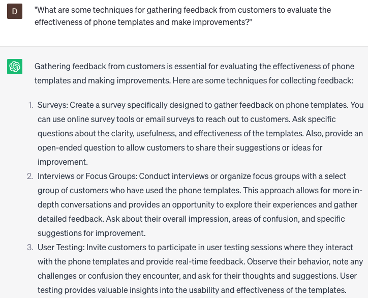

# Generating phone templates to ensure consistent messaging

### FILL-IN-THE-BLANK **PROMPTS:**

```jsx
Can you provide me with guidance on utilizing **[ChatGPT/any other AI language model]** to generate **[number]** phone templates for our **[team/department]**? I aim to establish consistent messaging, and I'm seeking assistance on leveraging AI language models for creating these templates.
```

```jsx
We aim to establish consistent messaging throughout all our phone communications at our company. Could you assist me in creating **[number]** templates using **[ChatGPT/any other AI language model]** that can streamline our phone communications process and ensure message consistency?
```

```jsx
Due to time constraints, I'm unable to manually create the desired number of phone templates that maintain consistent messaging. Can you assist me in generating **[number]** templates using **[ChatGPT/any other AI language model]** that we can utilize for our phone communications?
```

### QUESTIONS-BASED P**ROMPTS:**

1. "How can businesses develop phone templates that maintain a consistent brand voice and messaging across customer interactions?"
2. "What are some key elements to include in phone templates to ensure clarity and professionalism in customer conversations?"
3. "How can businesses customize phone templates to address specific customer needs or address common pain points?"
4. "What strategies can businesses employ to train their customer service representatives on effectively using phone templates for consistent messaging?"
5. "How can businesses optimize phone templates to handle different types of customer inquiries, such as complaints, product inquiries, or technical support?"
6. "What role does personalization play in phone templates, and how can businesses strike a balance between consistency and individualized customer experiences?"
7. "What are some best practices for updating and maintaining phone templates to reflect evolving customer needs and industry trends?"
8. "How can businesses ensure that their phone templates align with their overall customer service strategy and company values?"
9. "What are some techniques for gathering feedback from customers to evaluate the effectiveness of phone templates and make improvements?"
10. "How can businesses leverage technology, such as CRM systems or AI-powered tools, to enhance phone templates and streamline customer interactions?"

### EXAMPLES:

