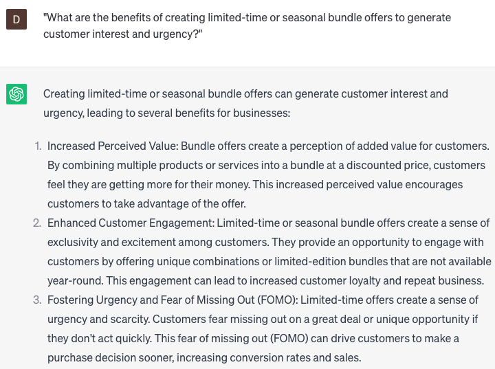

# Generating product bundle offers

### FILL-IN-THE-BLANK **PROMPTS:**

```jsx
Could you recommend a product bundle featuring **[product A], [product B],** and **[product C]**? I'm seeking a bundle that would be attractive to customers belonging to the **[target demographic]** who have expressed interest.
```

```jsx
Can you assist me in formulating a bundled offer comprising of **[product X]** and **[product Y]** specifically designed for customers who have previously bought **[product Z]**? I aim to create an enticing offer that encourages repeat purchases.
```

```jsx
Can you assist me in developing a bundle offer encompassing **[product X]**, **[product Y]**, and **[product Z]** targeted towards customers with a significant customer lifetime value? I aim to provide rewards to these valuable customers and foster their continued loyalty towards our brand.
```

### QUESTIONS-BASED P**ROMPTS:**

1. "How can product bundle offers provide added value to customers and drive sales?"
2. "What factors should be considered when selecting products to include in a bundle offer?"
3. "How can the pricing strategy for product bundles be optimized to incentivize customer purchases?"
4. "What strategies can be employed to effectively communicate the benefits and savings of product bundles to customers?"
5. "How can market research and customer segmentation help in identifying the most attractive product combinations for bundle offers?"
6. "What role does product positioning and merchandising play in promoting and showcasing product bundles?"
7. "What are the benefits of creating limited-time or seasonal bundle offers to generate customer interest and urgency?"
8. "How can customer feedback and data analysis be utilized to refine and improve the selection and composition of product bundles?"
9. "What techniques can be used to market and promote product bundles through various channels, such as social media or email campaigns?"
10. "In what ways can collaboration with complementary brands or businesses enhance the appeal and value of product bundle offers?"

### EXAMPLES:

