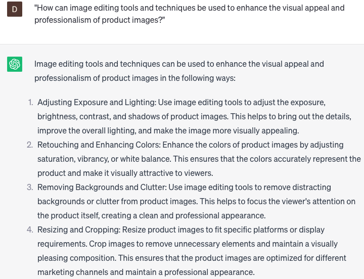

# Generating promotional product images

### FILL-IN-THE-BLANK **PROMPTS:**

```jsx
I'm **[initiating a product launch/rebranding campaign/running a promotional campaign]** and require a captivating product image that will **[differentiate from competitors/capture attention/convey my message effectively]**. Could you provide innovative design suggestions that will resonate with my **[target audience/demographic]** and **[stimulate sales/enhance engagement]**?
```

```jsx
I'm seeking a promotional product image that effectively showcases the **[benefits/features of my product/evokes a sense of urgency/encourages social sharing]**. Could you offer design suggestions that **[utilize my brand's colors and fonts/incorporate current design trends/reflect the personality of my brand]** to assist me in achieving this objective?
```

```jsx
I'm interested in developing a promotional product image for an upcoming **[event/occasion/holiday]**. Could you propose design concepts that **[integrate relevant themes/celebrate the occasion/present my product as a gift idea]** and are likely to resonate with my **[target audience/demographic]?**
```

### QUESTIONS-BASED P**ROMPTS:**

1. "How can visually appealing product images contribute to a successful promotional campaign?"
2. "What key elements should be considered when creating product images that evoke emotions and capture attention?"
3. "How can lighting, angles, and composition be utilized to showcase products in the most flattering way?"
4. "What strategies can be employed to ensure consistency and brand cohesiveness across promotional product images?"
5. "How can product images effectively convey the features, functionality, and unique selling points of a product?"
6. "What role does color psychology play in selecting and manipulating colors in promotional product images?"
7. "How can lifestyle or contextual imagery be incorporated to showcase the product's real-world usage and benefits?"
8. "What are the best practices for optimizing product images for various digital platforms and screen sizes?"
9. "How can image editing tools and techniques be used to enhance the visual appeal and professionalism of product images?"
10. "In what ways can user-generated content or customer-submitted images be leveraged to create authentic and relatable promotional product visuals?"

### EXAMPLES:

