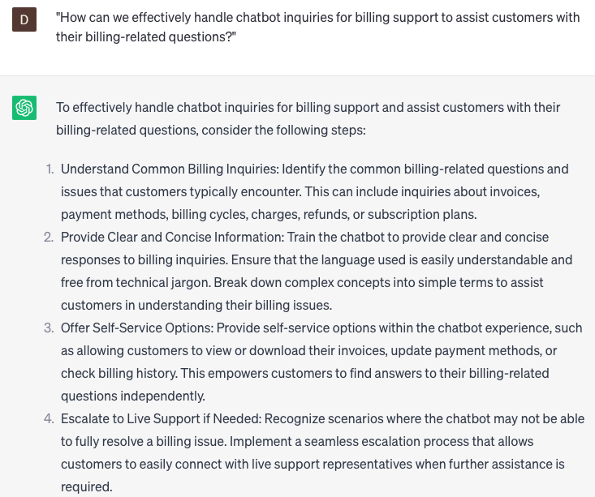

# Handling chatbot inquiries for billing support

### FILL-IN-THE-BLANK **PROMPTS:**

```jsx
When a customer raises a concern regarding their billing for **[product/service name]** and asks for guidance on resolving the issue, what information should I **[request to verify their account]** and what approach should I take to **[deliver instructions on resolving the issue]**?
```

```jsx
In the event that a customer notifies us of an incorrect charge on their billing statement for order number **[order number]**, what specific information should I **[seek from the customer]** and how can I **[aid the customer in disputing the charge]**?
```

```jsx
If a customer expresses their desire to **[cancel a recurring payment or subscription for a product/service]**, what specific information should I **[gather from the customer to verify their account]** and how can I **[assist the customer in successfully cancelling the payment/subscription]**?
```

### QUESTIONS-BASED P**ROMPTS:**

1. "How can we effectively handle chatbot inquiries for billing support to assist customers with their billing-related questions?"
2. "What strategies can we employ to train the chatbot in understanding and addressing various billing inquiries, such as invoice details, payment methods, or billing discrepancies?"
3. "Are there any specific billing systems or software we should integrate with the chatbot to provide accurate and up-to-date billing information?"
4. "How can we ensure that the chatbot provides clear and concise responses regarding billing policies, due dates, and payment options?"
5. "What measures should we take to personalize the chatbot responses based on the customer's specific billing situation or account details?"
6. "How can we guide customers through self-service options or provide step-by-step instructions within the chatbot responses for common billing tasks, such as updating payment information or requesting refunds?"
7. "Are there any legal or privacy considerations we should keep in mind when handling chatbot inquiries for billing support, such as handling sensitive financial information?"
8. "What steps can we take to seamlessly escalate complex billing issues from the chatbot to human agents for further assistance and resolution?"
9. "How can we provide proactive notifications or reminders within the chatbot responses to keep customers informed about upcoming payments or any changes to their billing accounts?"
10. "What strategies should we implement to gather feedback from customers regarding their experience with the chatbot for billing support and identify areas for improvement?"

### EXAMPLES:

