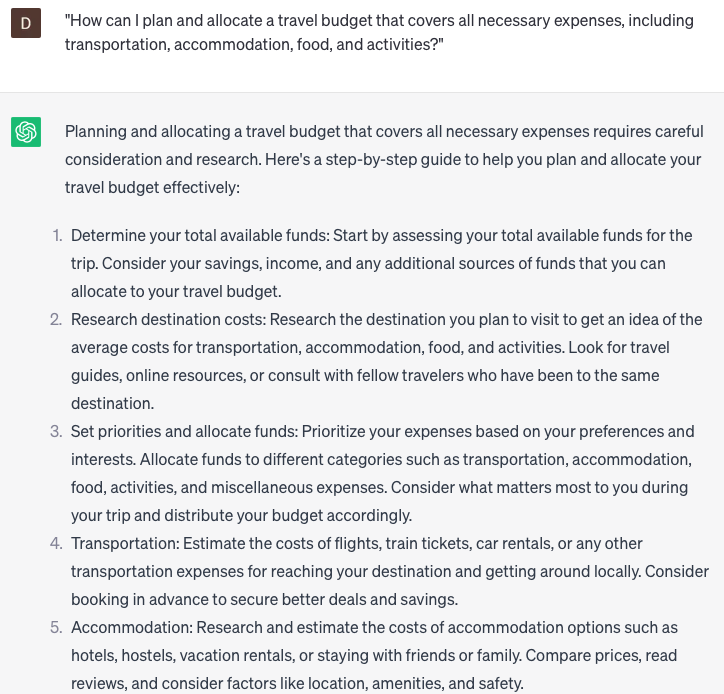

# Handling travel expenses

### FILL-IN-THE-BLANK **PROMPTS:**

```jsx
Could you suggest an affordable accommodation option suitable for **[number of travelers]** attending **[event name]** in **[city]**? We are looking for a place that is **[near/far]** from the event location and offers **[specific amenities]**.
```

```jsx
When it comes to handling travel expenses, what tips or methods can you suggest to **[manage costs/control travel spending/track expenses]?**
```

```jsx
Could you please compile a list of **[number of]** restaurants in **[destination city]** that cater to **[specific dietary restrictions]**? We are looking for **[meal type]** options that are **[budget-friendly/upscale]** and are **[within/outside]** walking distance of our **[accommodation place]**.
```

### QUESTIONS-BASED P**ROMPTS:**

1. "What are some practical tips for managing and tracking travel expenses to stay within budget?"
2. "Can you suggest effective strategies for saving money on transportation costs while traveling?"
3. "What are some recommended methods for handling foreign currency exchange and minimizing fees?"
4. "Are there any useful budgeting apps or tools that can help with tracking travel expenses on the go?"
5. "Can you provide insights on finding affordable accommodation options without compromising on quality and comfort?"
6. "What are some cost-saving measures for dining out while traveling, such as seeking local eateries or cooking meals?"
7. "Are there any tips for getting the best deals on attractions, tours, or entertainment options at my travel destination?"
8. "Can you suggest ways to effectively manage and reduce data roaming charges while using mobile devices abroad?"
9. "What are some recommended strategies for avoiding unnecessary or hidden fees when using payment methods abroad, such as credit cards, ATMs, or foreign transaction fees?"
10. "How can I plan and allocate a travel budget that covers all necessary expenses, including transportation, accommodation, food, and activities?"

### EXAMPLES:

