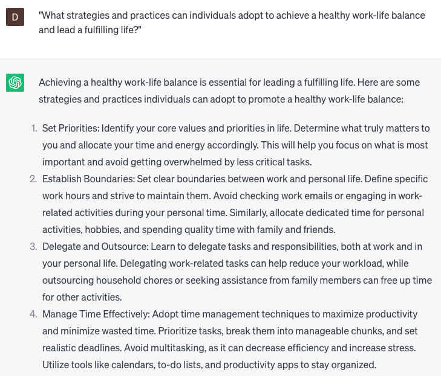

# Help improve work-life balance

### FILL-IN-THE-BLANK **PROMPTS:**

```jsx
Could you assist me in discovering methods to achieve a better work-life balance as a **[your occupation]** working at **[company name]**?
```

```jsx
What are some effective techniques or practices that individuals can implement to strike a healthy equilibrium between their **[work commitments/personal responsibilities]** and **[personal well-being/leisure time]**? Please consider factors such as **[time management techniques/stress reduction activities/establishing boundaries].**
```

```jsx
In what ways can I enhance my task delegation skills to mitigate **[specific issue]** and cultivate a healthier work-life balance as a **[your occupation]** at **[company name]**?
```

### QUESTIONS-BASED P**ROMPTS:**

1. "What strategies and practices can individuals adopt to achieve a healthy work-life balance and lead a fulfilling life?"
2. "How can setting clear boundaries between work and personal life contribute to improved work-life balance?"
3. "What role does effective time management play in achieving work-life balance and reducing stress?"
4. "How can mindfulness and self-care practices enhance work-life balance and overall well-being?"
5. "In what ways can flexible work arrangements and remote work options support a better work-life balance?"
6. "Why is it important to prioritize leisure activities and hobbies outside of work for a balanced lifestyle?"
7. "How can employers and organizations promote work-life balance initiatives and create a supportive work culture?"
8. "What are some effective techniques for managing work-related stress and preventing burnout?"
9. "Why is it essential to disconnect from digital devices and establish designated 'me-time' for improved work-life balance?"
10. "How can individuals leverage delegation and effective teamwork to achieve a better work-life balance?"

### EXAMPLES:

