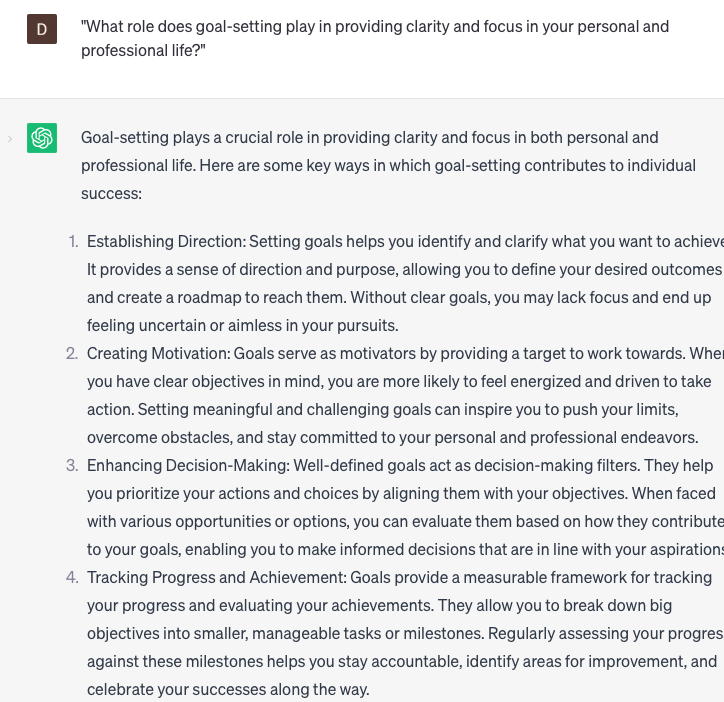

# Help set personal goals

### FILL-IN-THE-BLANK **PROMPTS:**

```jsx
What are some specific, measurable, attainable, relevant, and time-bound (SMART) goals that I can establish for my **[personal/professional]** life, ensuring they align with my values and priorities?
```

```jsx
Could you provide strategies that can assist me in overcoming my **[challenge]** and accomplishing my goal of **[specific goal]** within the given deadline of **[deadline]**?
```

```jsx
Could you suggest any tools or resources that can aid me in monitoring and tracking my progress towards achieving my goal of **[specific goal]**?
```

### QUESTIONS-BASED P**ROMPTS:**

1. "Why is it important to set personal goals that align with your values and aspirations?"
2. "How can setting specific and measurable personal goals increase your motivation and drive for success?"
3. "What role does goal-setting play in providing clarity and focus in your personal and professional life?"
4. "How do personal goals act as a roadmap for personal growth and self-improvement?"
5. "What impact can setting challenging yet attainable goals have on pushing your limits and unlocking your full potential?"
6. "How can reflecting on past achievements and failures help in setting realistic and meaningful personal goals?"
7. "What strategies can be employed to overcome obstacles and maintain momentum when pursuing personal goals?"
8. "How does setting short-term and long-term personal goals contribute to a sense of accomplishment and fulfillment?"
9. "What are the benefits of sharing your personal goals with others and seeking support and accountability?"
10. "How can setting personal goals foster a sense of purpose and direction in your life, guiding your actions and decisions?"

### EXAMPLES:

