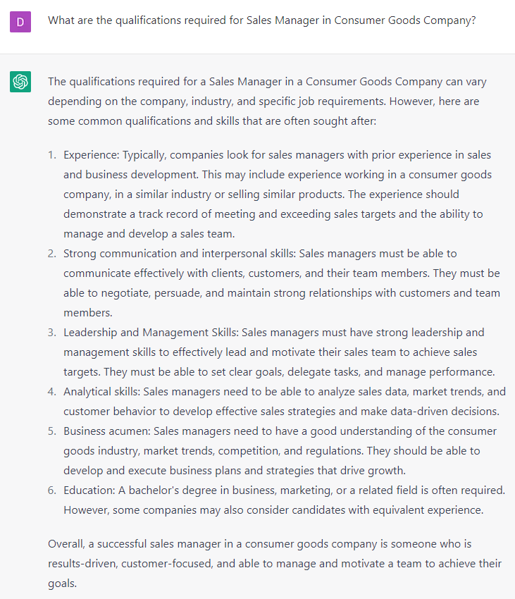

# Hiring and Leadership

### INSTRUCTIONAL **PROMPTS:**

```jsx
How can I create a personalized message for a new hire of **[role]** that highlights their unique strengths and contributions to the **[Company type]** team, while also making them feel valued and supported in their new role?
```

```jsx
What would be a good message to welcome a new hire to **[company details]** team and provide them with a brief overview of our company culture, values, and goals?
```

```jsx
How can I create a fun and engaging onboarding experience for a new hire in **[company type]**, that includes opportunities for them to get to know their colleagues, familiarize themselves with our company culture, and understand their role and responsibilities in **[role]**?
```

```jsx
How can I create a message for a new hire for **[role]**, that showcases our **[company type]** commitment to diversity, equity, and inclusion, and makes them feel welcome and valued as a member of our team?
```

### OPEN-ENDED **PROMPTS:**

1. “Imagine you're hiring a new customer service representative. What are some key skills and qualities you would look for in a candidate? What questions would you ask to assess their ability to handle customer inquiries and resolve issues?”
2. “You're hiring a new software developer. What technical skills and experience are important for this position? What questions would you ask to evaluate their coding abilities and problem-solving skills?”
3. “Imagine you're hiring a new marketing manager. What experience and qualifications are essential for this role? What questions would you ask to assess their understanding of your target market and their ability to develop effective marketing strategies?”
4. “You're hiring a new sales representative. What traits and qualities would you look for in a candidate for this position? What questions would you ask to evaluate their communication and persuasion skills, as well as their ability to meet sales targets?”
5. “Imagine you're hiring a new human resources manager. What experience and qualifications are essential for this role? What questions would you ask to assess their understanding of HR best practices and their ability to manage employee relations?”
6. “You're hiring a new accountant. What technical skills and experience are important for this position? What questions would you ask to evaluate their knowledge of accounting principles and their ability to analyze financial statements?”
7. “Imagine you're hiring a new graphic designer. What experience and qualifications are essential for this role? What questions would you ask to evaluate their creative abilities and their ability to work collaboratively with other team members?”
8. “You're hiring a new project manager. What traits and qualities would you look for in a candidate for this position? What questions would you ask to assess their leadership and organizational skills, as well as their ability to manage deadlines and budgets?”
9. “Imagine you're hiring a new administrative assistant. What skills and qualities are important for this role? What questions would you ask to evaluate their organizational abilities and their ability to handle multiple tasks and priorities?”
10. “You're hiring a new data analyst. What technical skills and experience are important for this position? What questions would you ask to evaluate their ability to analyze and interpret data, as well as their experience with data visualization tools and techniques?”

### FILL-IN-THE-BLANK **PROMPTS:**

```jsx
What are the qualifications required for **[**role**]** in **[**type of business**]?**
```

```jsx
What is the expected work schedule and company culture for **[**role**]** in **[**type of business**]?**
```

```jsx
Can you provide me a step-by-step tutorial on how to hire [role] for [type of company]?
```

### EXAMPLES:

