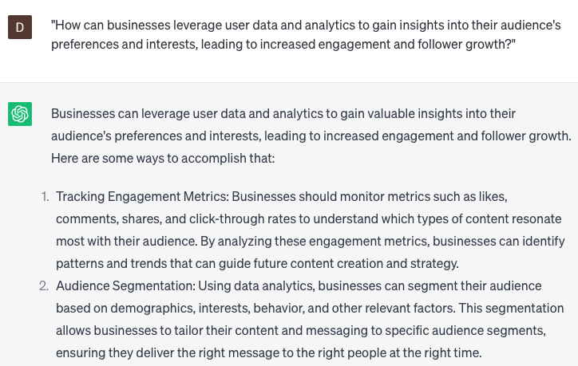

# Increasing engagement and followers

### FILL-IN-THE-BLANK **PROMPTS:**

```jsx
What are some inventive approaches I can take to stimulate engagement on my **[Instagram/Twitter/Facebook/LinkedIn]** platforms? I'm looking for unique and creative methods to promote and increase user interaction.
```

```jsx
Could you share a compilation of **[relevant/trending/popular]** hashtags for my **[industry/niche/brand]** specifically tailored to **[Instagram/Twitter/Facebook/LinkedIn]**? I'm seeking a list that can help boost the visibility and reach of my content on these platforms.
```

```jsx
In what ways can I leverage **[social media/analytics/data]** to enhance and optimize my **[content/strategy/plan]**, aiming to maximize engagement on **[Instagram/Twitter/Facebook/LinkedIn]**? I'm looking for insights and techniques to effectively utilize these tools and platforms for increasing audience interaction.
```

### QUESTIONS-BASED P**ROMPTS:**

1. "How can businesses use storytelling techniques to captivate their audience and increase engagement on social media?"
2. "What are some effective strategies for encouraging user-generated content and fostering a sense of community among followers?"
3. "How can businesses leverage influencer partnerships to expand their reach and gain more followers on social media?"
4. "What role does visual content, such as high-quality images and videos, play in increasing engagement and attracting more followers?"
5. "What are some creative ways businesses can incentivize their audience to like, share, and comment on social media posts?"
6. "How can businesses use interactive features, like polls and quizzes, to engage followers and encourage active participation?"
7. "What are some strategies for optimizing the timing and frequency of social media posts to maximize engagement and follower growth?"
8. "How can businesses effectively respond to comments, messages, and mentions on social media to build stronger connections with followers?"
9. "What are some techniques for conducting social media contests or giveaways to boost engagement and attract new followers?"
10. "How can businesses leverage user data and analytics to gain insights into their audience's preferences and interests, leading to increased engagement and follower growth?"

### EXAMPLES:

