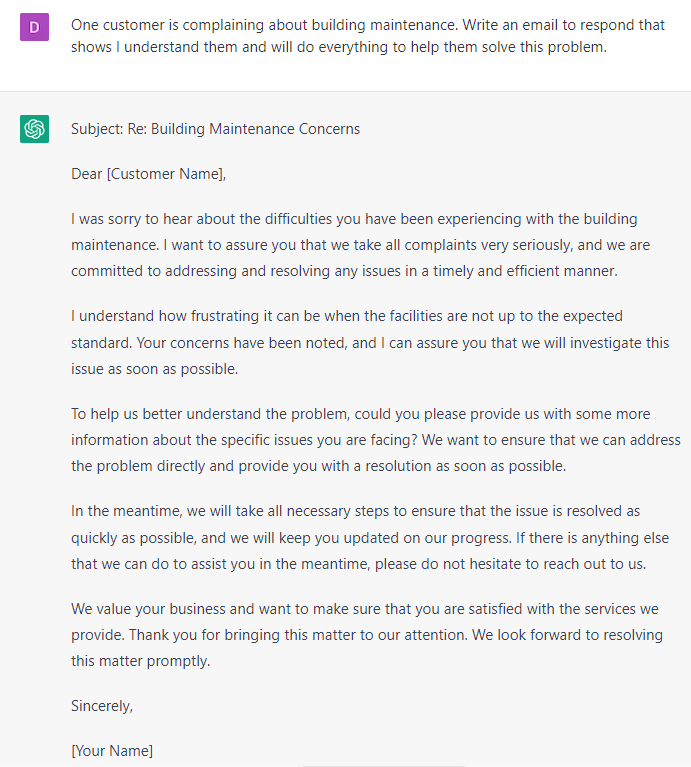

# Managing Communication With Clients

### FILL-IN-THE-BLANK **PROMPTS:**

```jsx
Rewrite this email for a customer with a more professional and warm tone: **[copy and paste message].**
```

```jsx
One customer is complaining about **[problem]**. Write an email to respond that shows I understand them and will do everything to help them solve this problem.
```

```jsx
Create a template for addressing common questions and concerns about **[problem or solution].**
```

```jsx
Can you help me write an email that acknowledges **[problem]**, apologizes and offers a solution to make it right?
```

```jsx
What are some effective ways to respond to a customer complaint in an email? The customer's complaint says: **[problem]**. Start the reply by introducing me, thanking the customer for their email, and addressing their inquiry.
```

### **OPEN-ENDED PROMPTS:**

1. “How can I open a customer service email in a professional and friendly manner?”
2. “Can you suggest some ways to acknowledge and empathize with the customer's issue or concern?”
3. “What are some best practices for clearly and concisely explaining the steps the customer needs to take to resolve the issue?”
4. “Can you provide some examples of language I can use to express appreciation for the customer's business?”
5. “How can I ensure that the tone of the email is consistent with my company's brand voice and values?"
6. “Can you suggest some ways to offer additional help or support beyond the initial email response?”
7. “What are some strategies for using language that reassures the customer that their issue is being taken seriously and that a solution will be found?”
8. “How can I effectively communicate any limitations or constraints that may affect the customer's ability to receive the outcome they desire?”
9. “Can you help me edit and proofread my email to ensure it is free from grammatical errors and typos?”
10. “How can I end the email in a way that makes the customer feel satisfied and appreciated, and encourages them to contact me if they need further assistance?”

### EXAMPLES**:**

