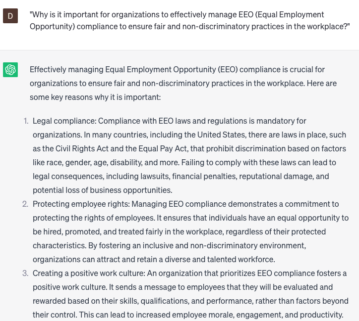

# Managing EEO compliance

### FILL-IN-THE-BLANK **PROMPTS:**

```jsx
What are the recommended approaches for ensuring Equal Employment Opportunity **(EEO)** compliance in **[specific industry/organization type]**? How can we effectively implement **[specific EEO practice]** to achieve **[specific goal]**? Furthermore, how can we assess the effectiveness of our initiatives using **[specific metrics]**?
```

```jsx
What strategies can we employ to identify and rectify any potential disparities in our **[specific hiring/promotion process]** within our **[specific location/department]**? What specific data should we collect to facilitate this **[specific action]**? Moreover, how can we effectively communicate our findings and action plan to **[specific stakeholder group]** in order to achieve the desired **[specific outcome]**?
```

```jsx
What are the statutory obligations for conducting an Equal Employment Opportunity (EEO) audit in **[specific state/country]** applicable to **[specific organization size/type]**? How should we proceed if we identify potential disparities in our data? Furthermore, how can ChatGPT be utilized to assist with **[specific task]** throughout the audit process?
```

### QUESTIONS-BASED P**ROMPTS:**

1. "Why is it important for organizations to effectively manage EEO (Equal Employment Opportunity) compliance to ensure fair and non-discriminatory practices in the workplace?"
2. "What are the key components of an EEO compliance management program that organizations should establish to promote diversity, inclusion, and equal opportunities for all employees?"
3. "How can organizations proactively monitor and address potential EEO violations to mitigate legal and reputational risks?"
4. "In what ways can organizations ensure that hiring practices, promotion decisions, and employee evaluations align with EEO requirements and principles?"
5. "What measures should be taken to create a culture of EEO compliance, including providing training and awareness programs to employees and managers?"
6. "How can organizations conduct regular audits and assessments to evaluate the effectiveness of their EEO compliance efforts?"
7. "What role can data analysis and reporting play in managing EEO compliance, allowing organizations to identify any disparities or inequities in employment practices?"
8. "How can organizations establish robust complaint mechanisms and investigation processes to address EEO concerns and ensure prompt resolution?"
9. "What steps should be taken to communicate EEO policies, procedures, and expectations to employees, reinforcing the organization's commitment to equal opportunities?"
10. "How can organizations stay updated on evolving EEO regulations and best practices, adapting their policies and practices accordingly to maintain compliance?"

### EXAMPLES:

