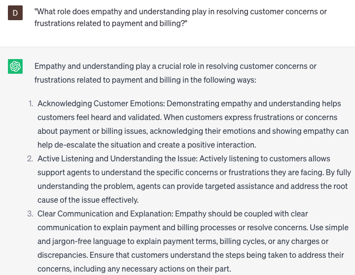

# Offering payment and billing support over the phone

### FILL-IN-THE-BLANK **PROMPTS:**

```jsx
I'm currently speaking with a customer who requires assistance with **[payment/billing support]**. I request your support in **[providing relevant information/resolving the issue]** for this particular customer.
```

```jsx
I require your assistance in **[providing information about/automating]** the **[payment/billing]** process for our customers. Could you **[guide me through/provide me with instructions]** on accomplishing this task?
```

```jsx
I seek your aid in **[enhancing/optimizing]** our **[billing/payment]** process. Can you please **[provide me with information/assist me in automating]** the process to ensure a smooth and seamless experience for our valued customers?
```

### QUESTIONS-BASED P**ROMPTS:**

1. "How can providing reliable payment and billing support over the phone contribute to customer satisfaction and loyalty?"
2. "What key elements should be considered when designing a phone support system for handling payment and billing inquiries?"
3. "How can customer authentication and data protection be ensured during phone interactions regarding payment and billing?"
4. "What strategies can be employed to assist customers with payment processing, account updates, or billing disputes over the phone?"
5. "How can clear and concise communication be maintained when explaining complex payment and billing processes over the phone?"
6. "What role does empathy and understanding play in resolving customer concerns or frustrations related to payment and billing?"
7. "What are the benefits of utilizing secure payment gateways or digital payment platforms to facilitate phone-based payment transactions?"
8. "How can customer education and self-service options be integrated into phone support for payment and billing inquiries?"
9. "What techniques can be used to proactively identify and address common payment and billing issues before customers need to reach out for support?"
10. "In what ways can customer feedback and satisfaction surveys be utilized to continuously improve the effectiveness of phone-based payment and billing support?"

### EXAMPLES:

