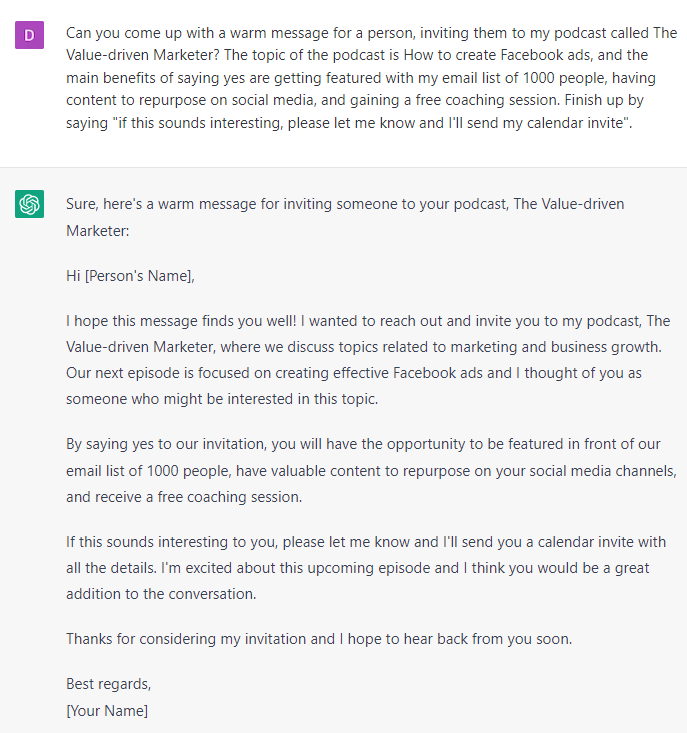

# Podcast Guest Outreach

### FILL-IN-THE-BLANK **PROMPTS:**

```jsx
Can you come up with a warm message for a person, inviting them to my podcast called **[name of the podcast]**? The topic of the podcast is **[topic]**, and the main benefits of saying yes are **[benefit 1]**, **[benefit 2]**, **[benefit 3]**. Finish up by saying "if this sounds interesting, please let me know and I'll send my calendar invite".
```

### OPEN-ENDED **PROMPTS:**

1. “Can you help me write an outreach message to invite guests to my podcast on [fill in the topic]?”
2. “I need a persuasive message to invite industry experts to be guests on my podcast. Can you write that for me?”
3. “Can you generate an invitation message to send to potential podcast guests who are thought-leaders in [fill in the industry]?”
4. “I'm looking for a way to reach out to guests and invite them to my podcast that covers [fill in the niche]. Can you help me with that?”
5. “Can you assist me in writing an outreach message to invite guests to my podcast that focuses on [fill in the topic]?”
6. “I need a compelling message to send to potential guests inviting them to be part of my podcast. Can you write that for me?”
7. “Can you help me write an outreach message that will convince guests to be on my podcast and share their expertise in [fill in the industry]?”
8. “I'm searching for a way to invite guests to my podcast that explores [fill in the niche]. Can you help me with that?”
9. “Can you write an outreach message for me that will persuade guests to participate in my podcast and share their unique insights on [fill in the topic]?”
10. “I need an effective message to send to potential guests to invite them to be part of my podcast on [fill in the topic]. Can you write that for me?”

### EXAMPLE:

