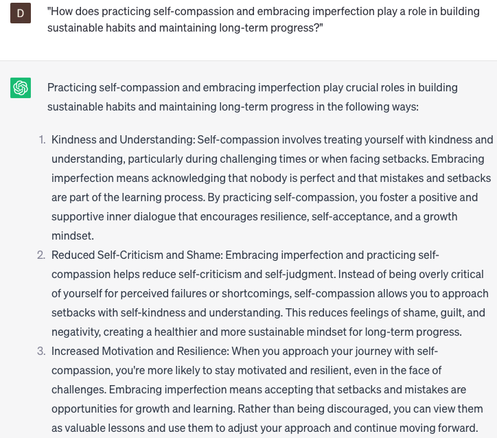

# Provide habit-building tips

### FILL-IN-THE-BLANK **PROMPTS:**

```jsx
Can you offer me some guidance on building habits that support my specific goal of **[your specific goal]**?
```

```jsx
What strategies can I employ to develop a habit of **[new habit]** while simultaneously breaking my habit of **[old habit]**?
```

```jsx
What practical tips and strategies can be implemented to develop long-lasting habits for **[specific goal or behavior]**?
```

### QUESTIONS-BASED P**ROMPTS:**

1. "How can starting small and focusing on one habit at a time help you build lasting changes in your daily routine?"
2. "What role does consistency play in forming new habits and how can you stay motivated during the early stages of habit-building?"
3. "In what ways can habit stacking or linking a new habit to an existing one facilitate the integration of positive behaviors into your lifestyle?"
4. "What benefits can be gained from tracking your progress and celebrating milestones as you work towards establishing a new habit?"
5. "How does creating a supportive environment, such as removing triggers or surrounding yourself with like-minded individuals, contribute to successful habit formation?"
6. "What strategies can individuals employ to overcome obstacles or setbacks when building new habits and maintain their motivation?"
7. "How can utilizing positive affirmations or visualization techniques assist in rewiring your mindset and reinforcing desired habits?"
8. "What impact can habit reminders, such as setting alarms or placing visual cues, have on reinforcing new behaviors and keeping them top of mind?"
9. "What are the advantages of incorporating accountability measures, such as partnering with a buddy or joining a support group, in your habit-building journey?"
10. "How does practicing self-compassion and embracing imperfection play a role in building sustainable habits and maintaining long-term progress?"

### EXAMPLES:

