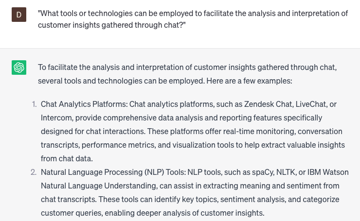

# Providing customer insights through chat

### FILL-IN-THE-BLANK **PROMPTS:**

```jsx
Could you please share insights regarding **[specific aspect of product/service] and its comparison to [specific competitor]**? I am keen on comprehending the relative merits of **[specific feature]** in relation to the corresponding feature offered by the competitor's **[product/service]**.
```

```jsx
Using **[specific metric, such as customer feedback or sales data]**, can you discern any discernible patterns or trends in customer usage of **[product/service]**? Are there any specific demographic or behavior-based segments that exhibit notable levels of engagement or disengagement?
```

```jsx
In terms of customer value, how does **[specific feature or aspect of product/service]** contribute to the overall value proposition? Are there any specific areas where customers perceive a notably high or low level of value compared to similar offerings in the market?
```

### QUESTIONS-BASED P**ROMPTS:**

1. "How can chat interactions be leveraged to gather valuable customer insights and feedback?"
2. "What strategies can be implemented to proactively identify customer pain points and preferences through chat conversations?"
3. "In what ways can chat data and analytics be utilized to gain a deeper understanding of customer behavior and needs?"
4. "What role does sentiment analysis play in extracting meaningful customer insights from chat interactions?"
5. "How can you effectively capture and document customer feedback and suggestions during chat sessions?"
6. "What measures can be taken to ensure privacy and data protection when collecting and analyzing customer insights through chat?"
7. "How can customer insights from chat be integrated with other data sources to create a holistic view of customer preferences and behaviors?"
8. "What are some best practices for translating customer insights obtained from chat into actionable improvements or innovations?"
9. "How can you use customer insights derived from chat to personalize and enhance the overall customer experience?"
10. "What tools or technologies can be employed to facilitate the analysis and interpretation of customer insights gathered through chat?"

### EXAMPLES:

