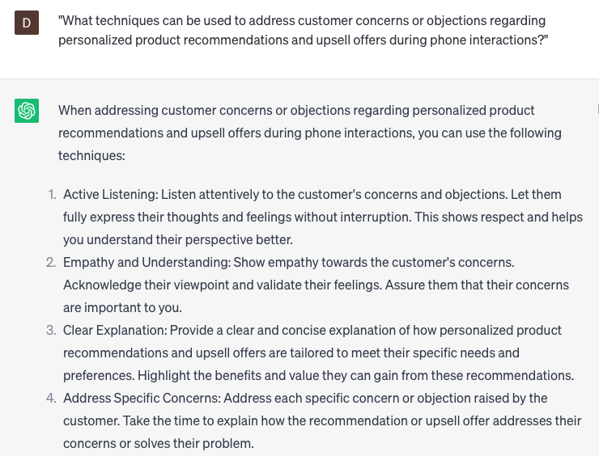

# Providing personalized product recommendations and upsells over the phone

### FILL-IN-THE-BLANK **PROMPTS:**

```jsx
Based on the customer's search history and previous purchases, could you provide recommendations for **[product category]**? What would you suggest considering **[customer's preference]**?
```

```jsx
I'm currently assisting a customer who has recently purchased **[product]**. Can you please provide recommendations for complementary products that can enhance their overall experience?
```

```jsx
I have a customer who is specifically interested in **[product category]**. Could you provide recommendations for products within that category that are currently on sale or have special discounts?
```

### QUESTIONS-BASED P**ROMPTS:**

1. "How can providing personalized product recommendations and upsells over the phone enhance the customer's shopping experience and increase sales?"
2. "What key factors should be considered when offering personalized product recommendations and upsells during phone interactions?"
3. "How can active listening and understanding customer preferences help in providing tailored product recommendations and upsell opportunities?"
4. "What strategies can be employed to effectively communicate the unique benefits and features of recommended products to customers over the phone?"
5. "How can cross-selling and upselling techniques be utilized to showcase complementary products and enhance the customer's overall purchase?"
6. "What role does product knowledge and expertise play in guiding customers towards suitable upsell options during phone conversations?"
7. "What are the benefits of offering exclusive promotions or discounts as part of personalized product recommendations and upsell offers over the phone?"
8. "How can customer feedback and purchase history be leveraged to provide more accurate and relevant personalized recommendations and upsell suggestions?"
9. "What techniques can be used to address customer concerns or objections regarding personalized product recommendations and upsell offers during phone interactions?"
10. "In what ways can ongoing training and coaching empower customer service representatives to provide effective personalized product recommendations and upsells over the phone?"

### EXAMPLES:

