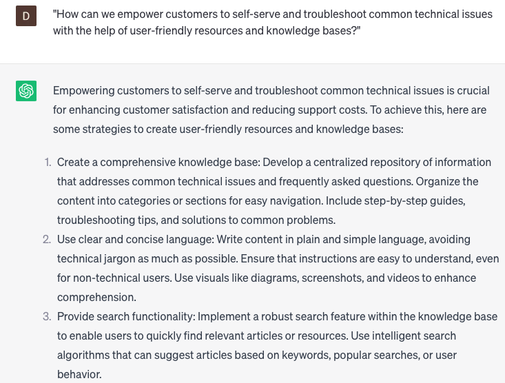

# Providing technical support

### FILL-IN-THE-BLANK **PROMPTS:**

```jsx
To provide more tailored technical support based on the customer's unique situation, could you furnish me with further elaboration on the **[specific problem/issue]** they are currently experiencing? This additional information will assist me in addressing their needs more effectively.
```

```jsx
Taking into account the customer's initial inquiry, could you suggest any specific **[troubleshooting steps/checks]** that I can propose to help address the **[specific issue/symptoms]** they are currently experiencing?
```

```jsx
To ensure the customer's complete understanding of the solution and prevent any potential confusion, could you please provide clarification on any **[technical jargon/terms/abbreviations]** that the customer might not be familiar with?
```

### QUESTIONS-BASED P**ROMPTS:**

1. "How can we deliver effective technical support to our customers to help them resolve complex technical issues?"
2. "What strategies can we employ to ensure clear and concise communication when providing technical support?"
3. "Are there any specific tools or software applications we should utilize to enhance our technical support capabilities?"
4. "How can we balance the need for timely support responses with the thoroughness required to address technical issues accurately?"
5. "What steps should we take to actively listen to customers and understand the full scope of their technical problems before offering solutions?"
6. "Are there any best practices for remotely diagnosing and troubleshooting technical issues to provide efficient support?"
7. "How can we effectively document and track technical support interactions to maintain a comprehensive support history for each customer?"
8. "What measures can we take to ensure ongoing training and skill development for our technical support team to keep up with evolving technologies?"
9. "How can we empower customers to self-serve and troubleshoot common technical issues with the help of user-friendly resources and knowledge bases?"
10. "What strategies should we implement to proactively communicate updates, known issues, and workarounds to customers to prevent unnecessary support inquiries?"

### EXAMPLES:

