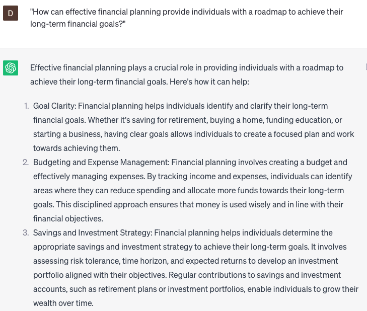

# Recommend financial planning

### FILL-IN-THE-BLANK **PROMPTS:**

```jsx
Could you offer a financial planning recommendation for **[work area]**, pertaining to a **[industry]**-based company with an annual revenue of **[revenue]** and **[number]** employees?
```

```jsx
Can you recommend best practices for **[budgeting/managing expenses/saving for the future/investing wisely]** and **[managing debt/credit card usage]**? Additionally, please provide insights on long-term financial goals, **[retirement planning/estate planning/wealth preservation]**, and techniques to mitigate financial risks.
```

```jsx
Considering the **[person/company]**'s **[tax bracket]** tax bracket, what would be the most tax-efficient method to invest their income from **[source]**?
```

### QUESTIONS-BASED P**ROMPTS:**

1. "Why is it crucial to recommend financial planning as a fundamental step towards building a secure and prosperous future?"
2. "How can effective financial planning provide individuals with a roadmap to achieve their long-term financial goals?"
3. "What role does recommended financial planning play in managing debt and ensuring financial stability?"
4. "Why is it important to recommend financial planning as a means to create an emergency fund and be prepared for unexpected expenses?"
5. "In what ways can recommended financial planning help individuals make informed investment decisions and grow their wealth?"
6. "How does financial planning contribute to minimizing financial stress and promoting peace of mind?"
7. "Why is it essential to recommend financial planning as a tool for retirement preparation and securing a comfortable post-work life?"
8. "What impact can recommended financial planning have on improving financial literacy and empowering individuals to make sound financial decisions?"
9. "Why is it crucial to recommend financial planning to entrepreneurs and small business owners to ensure the success and sustainability of their ventures?"
10. "How can recommended financial planning enable individuals to fulfill their aspirations and live a life of financial freedom?"

### EXAMPLES:

