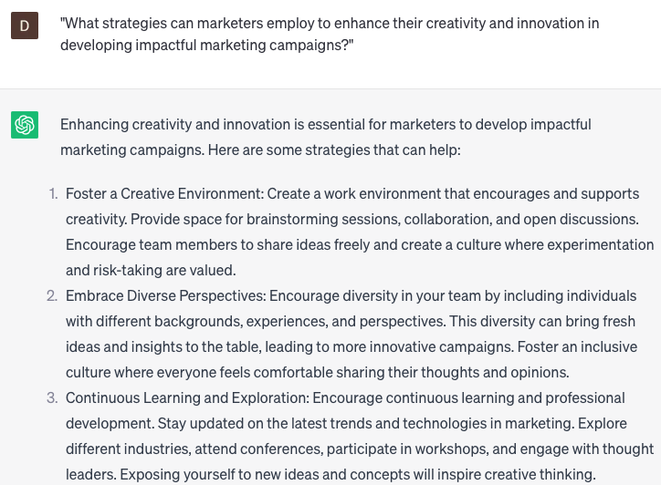

# Recommend personal development

### FILL-IN-THE-BLANK **PROMPTS:**

```jsx
What steps can **[individual]** take to enhance their **[skill/knowledge]** and achieve their **[goal/aspiration]**? Could you create a customized development plan that includes actionable steps, relevant resources, and timelines?
```

```jsx
What strategies and best practices can be employed by **[company]** to optimize its training and development programs, ensuring they cater to the needs and preferences of its employees? Please provide insights on designing, delivering, and evaluating effective learning experiences.
```

```jsx
What are the current trends and challenges arising in **[field/area]**, and how can **[individual/company]** proactively stay ahead of these developments? Please offer insights and recommendations regarding relevant skills, technologies, and approaches to adopt.
```

### QUESTIONS-BASED P**ROMPTS:**

1. "How can marketers continuously develop their skills and stay updated with the latest industry trends and technologies?"
2. "What strategies can marketers employ to enhance their creativity and innovation in developing impactful marketing campaigns?"
3. "How can marketers improve their communication and storytelling skills to effectively engage with their target audience?"
4. "What role does personal branding play in the professional growth of marketers, and how can they cultivate and showcase their unique value proposition?"
5. "How can marketers develop a data-driven mindset and leverage analytics to drive insights and optimize marketing strategies?"
6. "What strategies can marketers utilize to enhance their strategic thinking and problem-solving abilities in a dynamic and competitive market?"
7. "How does self-awareness contribute to the effectiveness of marketers, and what practices can help them develop a deeper understanding of their strengths and weaknesses?"
8. "How can marketers enhance their networking skills and build meaningful professional relationships within the industry?"
9. "What steps can marketers take to continuously expand their knowledge and expertise beyond their core specialization, fostering a holistic understanding of marketing?"
10. "How can marketers cultivate resilience and adaptability to navigate the ever-changing landscape of consumer behavior and market dynamics?"

### EXAMPLES:

