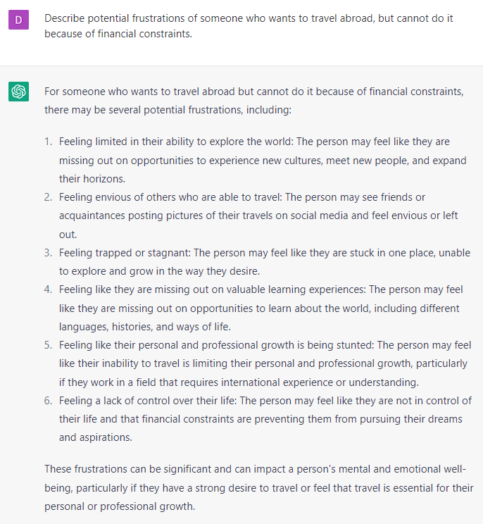
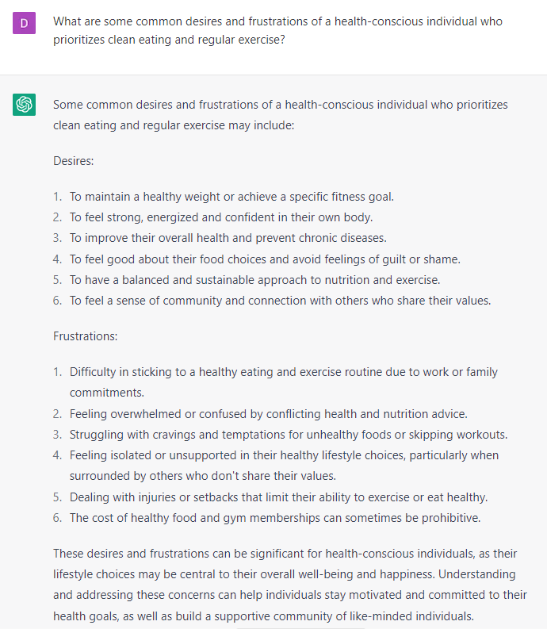

# Researching Your Ideal Client’s Pain Points and Desires

### FILL-IN-THE-BLANK PROMPTS**:**

```jsx
Write an Emotional 500-word Journal Entry from the perspective of **[ideal client]** who is struggling with **[pain points]**. He feels **[emotions]** and wants to **[dream outcomes]**.
```

```jsx
Describe potential frustrations of someone who wants **[desire]**, but cannot do it because **[blocks].**
```

```jsx
What are some common desires and frustrations of **[ideal customer]**?
```

```jsx
List 20 possible audiences on Facebook who could be interested in **[product or solution].**
```

### OPEN-ENDED PROMPTS**:**

1. “Can you help me research my ideal customer and provide insights into their demographics and psychographics?”
2. “I want to know more about my target audience. Can you gather information on their interests and behavior?”
3. “Can you provide me with data on my ideal customer's pain points and challenges?”
4. “I'm looking to understand the needs and preferences of my target audience better. Can you conduct research and provide me with insights?”
5. “Can you help me identify the keywords and phrases my ideal customer is searching for online?”
6. “I need to know more about my target audience's buying habits. Can you gather data on their purchasing behavior?”
7. “Can you provide me with information on the social media platforms my ideal customer is most active on?”
8. “I want to learn more about my ideal customer's values and beliefs. Can you help me research this?”
9. “Can you gather data on the content and media preferences of my target audience?”
10. “I'm looking for insights into the challenges my ideal customer is facing in their daily lives. Can you help me research this?”

### EXAMPLES:



