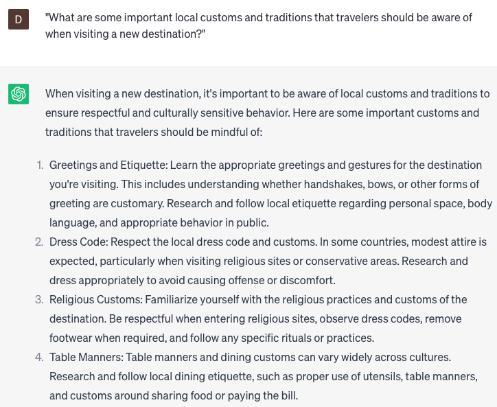

# Researching local customs

### FILL-IN-THE-BLANK **PROMPTS:**

```jsx
Could you provide insights on the cultural practices and traditions related to **[food/drink]** in **[country/region]**?
```

```jsx
Can you provide insights on the historical significance, traditional practices, and societal customs associated with **[food/drink]** in **[country/region]**, highlighting the role they play in shaping cultural identity and fostering social connections?
```

```jsx
What are culturally appropriate **[gifts/souvenirs]** to bring when **[visiting/staying with] [hosts/friends]** in **[country/region],** and are there any items that should be avoided?
```

### QUESTIONS-BASED P**ROMPTS:**

1. "What are some important local customs and traditions that travelers should be aware of when visiting a new destination?"
2. "Can you provide insights into the etiquette and cultural norms of the local community to help me navigate social interactions?"
3. "What are the customary greetings and appropriate body language to use when interacting with locals in the area?"
4. "Are there any specific dining customs or table manners that I should follow when immersing myself in the local culture?"
5. "Can you share information about the typical dress code or clothing considerations that are important to respect local customs?"
6. "What are some common gestures or actions that may have different meanings or implications in the local culture?"
7. "Are there any religious or spiritual practices that are significant in the region, and how can I respectfully engage with them?"
8. "Can you provide insights into the concept of personal space and acceptable physical contact in the local culture?"
9. "What are some social taboos or sensitive topics that I should avoid discussing to ensure cultural sensitivity?"
10. "How can I demonstrate respect for the local customs and traditions during my visit and interact with locals in a culturally appropriate manner?"

### EXAMPLES:

