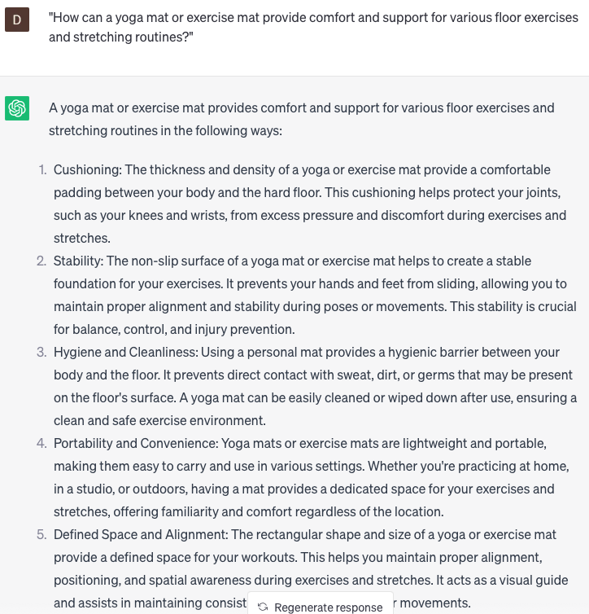

# Suggest home workout equipment

### FILL-IN-THE-BLANK **PROMPTS:**

```jsx
What home workout equipment do you suggest for individuals aiming to **[achieve specific goal]**, taking into consideration their **[limitations or preferences]**?
```

```jsx
To specifically target my **[muscle group]**, what equipment would you recommend for workouts at **[beginner/intermediate/advanced]** level?
```

```jsx
In case I have limited equipment at home, what are some effective exercises that utilize **[specific equipment]** for **[type of exercise]**?
```

### QUESTIONS-BASED P**ROMPTS:**

1. "What home workout equipment would you recommend for creating a versatile and effective fitness routine?"
2. "How can investing in home workout equipment save time and make exercising more convenient?"
3. "In what ways can home workout equipment help individuals stay consistent and motivated in their fitness journey?"
4. "What benefits can be gained from incorporating resistance bands into your home workout routine?"
5. "How does having a set of dumbbells or kettlebells at home enhance the variety and intensity of your strength training workouts?"
6. "What role does a stability ball play in improving core strength and balance during home workouts?"
7. "How can a yoga mat or exercise mat provide comfort and support for various floor exercises and stretching routines?"
8. "What impact can a stationary bike or treadmill have on cardiovascular health and endurance when used for home workouts?"
9. "What are the advantages of using a jump rope as an affordable and portable cardiovascular exercise tool?"
10. "How does a multi-functional home gym or resistance training system offer a comprehensive workout experience in the comfort of your own home?"

### EXAMPLES:

