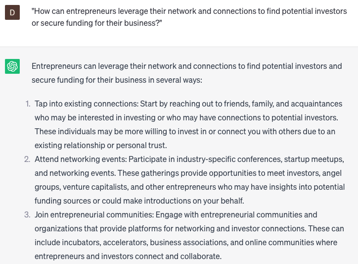

# Suggest investments

### FILL-IN-THE-BLANK **PROMPTS:**

```jsx
What are some investment alternatives that match my preferences for **[insert investment preference]** and **[insert risk tolerance]**? My long-term objective is to achieve **[insert financial goal]**.
```

```jsx
For individuals looking to explore investment opportunities, what types of **[investment options/assets/financial instruments]** can you suggest? Consider **[low-risk/medium-risk/high-risk]** investments that align with **[short-term/long-term]** financial goals and **[provide potential for growth/offer stable returns/fit individual risk tolerance]**.
```

```jsx
Can you recommend investment options that possess **[insert specific qualifier]** characteristics and are suitable for an individual with **[insert risk tolerance]** risk tolerance and a **[insert financial goal]** goal?
```

### QUESTIONS-BASED P**ROMPTS:**

1. "What investment options do you recommend for entrepreneurs seeking to grow their business and generate returns?"
2. "Can you provide insights on how venture capital or angel investors can play a role in funding entrepreneurial ventures?"
3. "How can entrepreneurs evaluate and assess the potential risks and rewards associated with different investment opportunities?"
4. "What factors should entrepreneurs consider when deciding between debt financing and equity financing for their business?"
5. "Can you explain the concept of crowdfunding and how it can be utilized as an investment strategy for entrepreneurial projects?"
6. "What are some alternative investment vehicles, such as peer-to-peer lending or real estate crowdfunding, that entrepreneurs can explore?"
7. "How can entrepreneurs identify and approach strategic partners or industry experts who may be interested in investing in their business?"
8. "Can you provide examples of successful investments made in similar entrepreneurial ventures and the lessons learned from those experiences?"
9. "What due diligence steps should entrepreneurs take when evaluating potential investors or investment opportunities?"
10. "How can entrepreneurs leverage their network and connections to find potential investors or secure funding for their business?"

### EXAMPLES:

