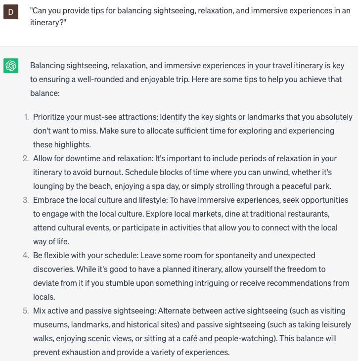

# Suggest itineraries

### FILL-IN-THE-BLANK **PROMPTS:**

```jsx
I'm in the process of organizing a trip to **[destination]** for a **[type of trip]**, and I require assistance with itinerary planning. My budget is **[budget]**, and I'm interested in **[activities/interests]**. I have **[number of days]** at my disposal. Could you suggest an itinerary that aligns with my requirements?
```

```jsx
For individuals seeking itinerary suggestions, what sample itineraries or day-by-day plans do you recommend for **[destination/city/region]**?
```

```jsx
I'm in the process of planning a family vacation to **[destination]** with **[number of family members]** family members. Our budget is **[budget]**, and we will be staying for **[number of days]**. Could you assist me in creating an itinerary that includes activities suitable for both children and adults?
```

### QUESTIONS-BASED P**ROMPTS:**

1. "What are some important factors to consider when creating a travel itinerary?"
2. "Can you provide tips for balancing sightseeing, relaxation, and immersive experiences in an itinerary?"
3. "What are some strategies for optimizing time and maximizing the enjoyment of each destination in an itinerary?"
4. "Are there any recommended approaches for incorporating local culture and authentic experiences into a travel itinerary?"
5. "Can you suggest ways to prioritize attractions and activities in an itinerary based on personal interests and preferences?"
6. "What are some considerations for planning transportation and logistics within an itinerary?"
7. "Are there any tips for allowing flexibility in an itinerary to accommodate unexpected changes or spontaneous discoveries?"
8. "Can you provide insights on how to allocate sufficient time for rest and relaxation in an itinerary?"
9. "What are some recommended resources or websites for finding pre-designed itineraries or inspiration for different destinations?"
10. "How can travelers strike a balance between having a structured itinerary and leaving room for serendipity and exploration?"

### EXAMPLES:

