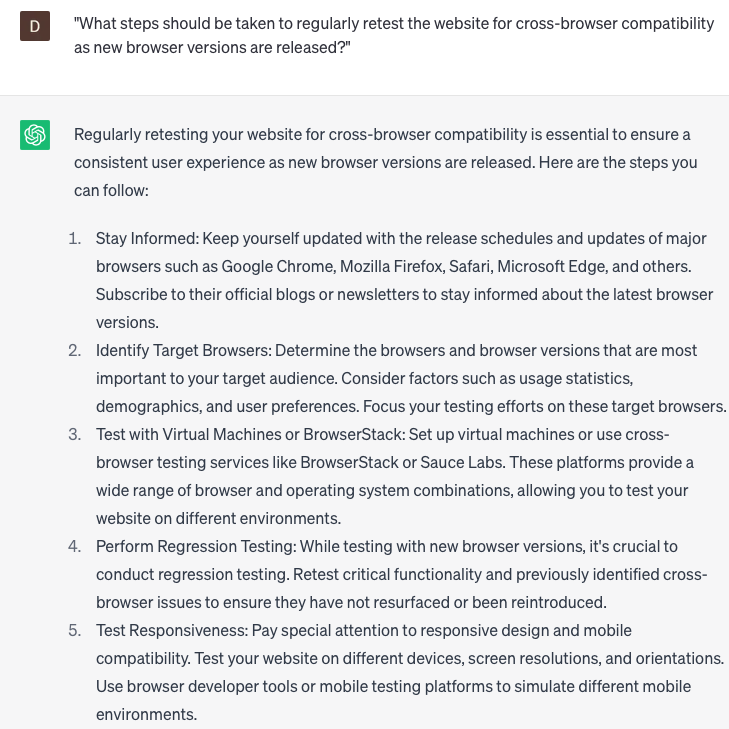

# Test website for cross-browser compatibility

### FILL-IN-THE-BLANK **PROMPTS:**

```jsx
What strategies can be employed to troubleshoot **[specific issues(s)]** that occur during cross-browser testing, particularly when encountering variations in **[specific programming language]** implementation across different **[specific browser name(s)]**?
```

```jsx
Taking into account Nielsen's 'Diversity-Usability Tradeoff' model, how would you plan a comprehensive cross-browser testing process for your target audience of **[specific audience(s)]** who use **[specific browser name(s)]** on **[specific device(s)]**?
```

```jsx
What are the available tools for testing a website's cross-browser compatibility on **[operating system(s)]** using **[specific browser name(s)]**?
```

### QUESTIONS-BASED P**ROMPTS:**

1. "How can we ensure that our website is tested for cross-browser compatibility to provide a consistent experience for all users?"
2. "What are the common challenges and issues that may arise when testing a website for cross-browser compatibility?"
3. "How can we identify and prioritize the browsers and versions that are most relevant to our target audience during the testing process?"
4. "What tools or techniques can be used to simulate different browsers and test the website's functionality and appearance across multiple platforms?"
5. "What are the best practices for testing responsive design and ensuring that the website adapts properly to different screen sizes and resolutions?"
6. "How can we validate and verify that all interactive elements, such as forms, buttons, and menus, work consistently across various browsers?"
7. "Are there any specific CSS or JavaScript considerations that need to be taken into account when testing for cross-browser compatibility?"
8. "What measures can be taken to address and resolve any compatibility issues or discrepancies identified during the testing phase?"
9. "How can we effectively document and track the results of cross-browser compatibility testing to facilitate ongoing maintenance and future updates?"
10. "What steps should be taken to regularly retest the website for cross-browser compatibility as new browser versions are released?"

### EXAMPLES:

