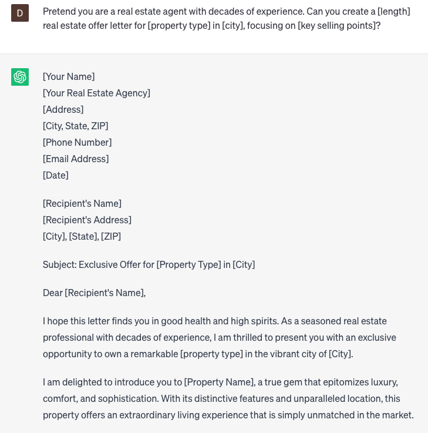

# Write real estate offer letters

### FILL-IN-THE-BLANK **PROMPTS:**

```jsx
Pretend you are a real estate agent with decades of experience. Can you create a **[length]** real estate offer letter for **[property type]** in **[city]**, focusing on **[key selling points]**?
```

```jsx
Compose a persuasive offer letter that highlights the allure of a **[property type]** in **[city]**. Channeling the strategies from Barbara Corcoran's best-selling book, 'Shark Tales,' emphasize the unique features of the property, including **[key amenities]**, while skillfully weaving in the vibrant community spirit and unparalleled growth potential of the **[neighborhood]**.
```

```jsx
What is the most effective approach to composing an offer letter for a **[property type]** in **[city]**, considering the [target audience] and integrating **[custom requests]**, all while maintaining a **[professional]** tone?
```

### QUESTIONS-BASED P**ROMPTS:**

1. "How can you effectively convey your genuine interest and enthusiasm for a property in your real estate offer letter?"
2. "What key components should be included in a well-crafted real estate offer letter to make a strong impression on the seller?"
3. "How can you showcase your financial credibility and readiness to purchase in your real estate offer letter?"
4. "What are some persuasive language techniques that can help you negotiate favorable terms in your real estate offer letter?"
5. "How important is it to research and understand the seller's motivations and circumstances before writing your real estate offer letter?"
6. "What are some effective ways to personalize your real estate offer letter to resonate with the seller on an emotional level?"
7. "How can you address potential concerns or objections in your real estate offer letter to alleviate any doubts the seller may have?"
8. "What role does a well-written cover letter play in complementing your real estate offer letter and strengthening your overall offer?"
9. "How can you strike a balance between being assertive and respectful in your real estate offer letter to maintain a positive rapport with the seller?"
10. "What are some closing strategies and techniques you can employ in your real estate offer letter to create a sense of urgency and motivate the seller to accept your offer?"

### EXAMPLES:

